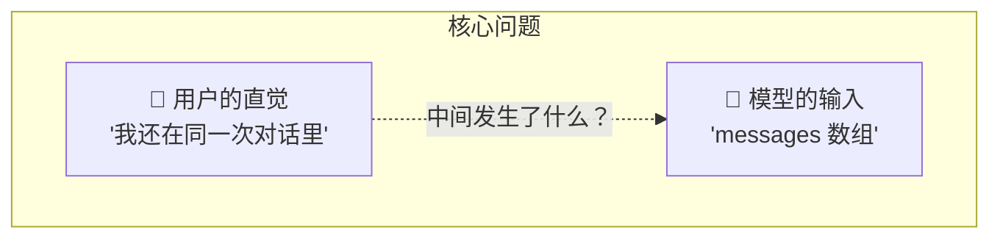
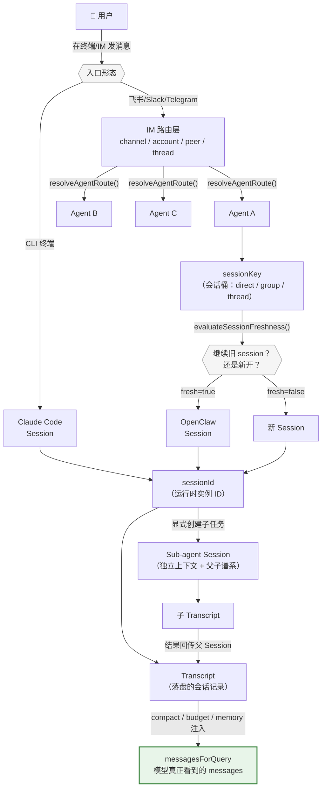
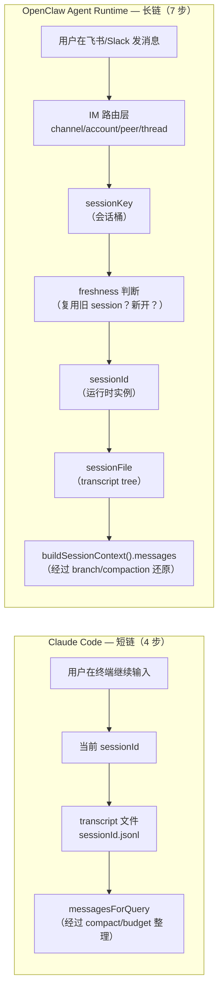

# Session：从用户到模型的映射链

## 核心问题

> **"用户觉得自己还在同一次对话里继续聊"这件事，到"模型本轮真正看到的 messages"之间，到底发生了多少次转换？**

这个问题看似简单，但答案因产品形态而完全不同。Claude Code 是本地 CLI，用户直接面对一个终端——映射链很短。OpenClaw Agent Runtime 是多通道网关，用户可能从飞书 / Slack / Telegram 进来——映射链很长。**链长链短不是因为谁更先进，而是因为它们面对的问题域不同。**



---

## 概念全景图：Session 世界的完整地图

在深入每一层之前，先看一张完整的概念地图。Session 相关的所有概念——多 Agent 路由、会话桶、时间策略、父子 Session、Sub-agent——都在这张图上标出了各自的位置和关系。



**怎么读这张图：**

- **顶部**是用户入口。CLI 直接进入 Session，IM 先过路由层再进 Session
- **中间**是 Session 的核心链路：sessionKey → freshness → sessionId → transcript → messages
- **右侧分叉**是 Sub-agent：从父 Session 派生，有独立上下文，结果回传
- **绿色高亮**的 `messagesForQuery` 是终点——所有路径最终都汇入这里

**几个容易混淆的边界：**

| 概念 | 它是不是一个独立的 Session？ | 为什么 |
|------|:---:|------|
| 同一终端继续聊 | 否，同一个 Session | sessionId 不变 |
| `/clear` 之后 | 是，新 Session | regenerateSessionId() 生成新 ID |
| `/resume` 切回旧对话 | 是，但切到旧 Session | switchSession() 恢复旧 ID |
| Sub-agent（CC） | 半独立 | 同 session 目录下的 sidechain transcript |
| Sub-agent（OC） | 独立 | 全新的 childSessionKey + sessionId |
| 同一个 IM 群里的多个 Agent | 各自独立 | resolveAgentRoute() 分发到不同 Agent 的不同 sessionKey |

---

## 两条映射链的对比

上面是全景，下面聚焦到**单个用户消息**从发出到进入模型的完整路径：



每多一步，都是因为**要解决一个 Claude Code 不需要面对的问题**。下面逐层展开。

---

## 设计解读：每一层解决什么问题

### 第 1 层：用户的直觉边界

两边相同：用户只有一个朴素的直觉——"我还在同一次对话里继续聊"。这是入口，不是模型输入。

关键区别在于：这个直觉**靠什么维持**？

- **Claude Code**：靠终端窗口。窗口开着 = 对话在继续。关窗口或 `/clear` = 对话结束。用户的直觉和系统边界几乎 1:1 对齐。
- **OpenClaw**：靠 IM 的对话容器（一个 DM、一个群聊、一个帖子线程）。但同一个 DM 昨天和今天发的消息，应该当同一次对话吗？这就需要后面的 freshness 层来回答。

### 第 2 层：IM 路由——消息从哪来？

> **这层解决的问题**：同一个用户可能从 3 个不同平台发消息给同一个 Agent，怎么归类？

**Claude Code 完全没有这一层。** 它是本地 CLI，不存在"消息从哪个渠道进来"的问题。

**OpenClaw 必须有这层。** `resolveAgentRoute()` 用 `channel / account / peer / thread` 这组外部身份，先决定消息属于哪个 Agent，再算出 `sessionKey`（会话桶）和 `mainSessionKey`。

```typescript
// openclaw/src/routing/resolve-route.ts#L631
// 这是链条的起点：先把外部 IM 身份映射成内部的 agent + sessionKey
const route = resolveAgentRoute({
  channel,   // 飞书 / Slack / Telegram
  accountId, // 哪个 bot 账号
  peer,      // 对话对象（人或群）
  parentPeer // 帖子的父对话
})
```

**OC 的 route 匹配有 8 级优先级，从最精确到最宽泛依次尝试**（源码 `resolve-route.ts#L749-L808`）：

| 优先级 | 匹配维度 | 说明 |
|:---:|---------|------|
| 1 | `binding.peer` | 精确匹配对话对象（某个具体的用户/群） |
| 2 | `binding.peer.parent` | 帖子场景：匹配帖子的父对话 |
| 3 | `binding.peer.wildcard` | 匹配某类对话（如所有 direct、所有 group） |
| 4 | `binding.guild+roles` | Discord 场景：匹配服务器 + 角色 |
| 5 | `binding.guild` | 匹配 Discord 服务器 |
| 6 | `binding.team` | 匹配 Slack workspace |
| 7 | `binding.account` | 匹配某个 bot 账号 |
| 8 | `binding.channel` | 匹配通道（如所有来自 Slack 的消息） |

所有层都没命中 → 使用 `default` agent。

这套分层匹配的意义在于：**一个 OpenClaw 实例可以在同一个 Slack workspace 里，不同群指向不同 Agent**。比如 `#engineering` 群路由到 Code Agent，`#support` 群路由到 Support Agent——通过 binding 配置，不需要部署多个实例。

> **设计洞察**：OpenClaw 对 session 的一切复杂性，根源在于它要支持多通道接入。如果只支持一个通道，这一层根本不需要存在。

### 第 3 层：会话桶（sessionKey）—— 消息该归到哪类对话？

> **这层解决的问题**：同一个 Agent 下，私聊、群聊、帖子线程怎么隔离？

**Claude Code**：没有这一层。一个终端就是一个 session，不存在"归类"。

**OpenClaw**：`sessionKey` 是一个字符串形式的会话桶 ID。不同的对话场景产出不同形状的 key：

| 场景 | sessionKey 形状 | 为什么这么设计 |
|------|----------------|---------------|
| 私聊 | `direct:{peerId}` | 一对一关系，天然隔离 |
| 群聊 | `group:{channelId}:{peerId}` | 同一个群但不同 bot 要分开 |
| 帖子 | `thread:{parentKey}:{threadId}` | 帖子是父对话的子分支 |
| 子代理 | `agent:{agentId}:subagent:{uuid}` | 子任务需要独立桶 |

```typescript
// openclaw/src/config/sessions/session-key.ts#L29
// sessionKey 是外层会话桶，不等于 sessionId，也不等于模型 history
```

> **设计洞察**：`sessionKey` 和 `sessionId` 是两个不同的抽象层。sessionKey 回答"这条消息**该归到哪类对话**"，sessionId 回答"这次**具体恢复哪个运行实例**"。很多对 OpenClaw session 机制的困惑，根源是把这两层混为一谈。

### 第 4 层：时间策略（freshness）—— 旧对话还能继续吗？

> **这层解决的问题**：上次聊天是昨天的事了。应该接着聊，还是开新对话？

**Claude Code**：**默认没有自动时间切分。** 只靠用户的显式动作：`/clear` 开新 session，`/resume` 切回旧 session。这是一个有意的设计选择——作为开发工具，Claude Code 认为**编程任务的边界应该由用户决定**，而不是系统猜测。

```typescript
// claude-code/src/bootstrap/state.ts#L435
// /clear 时：显式开新 sessionId，旧 session 记为 parent
export function regenerateSessionId(
  options: { setCurrentAsParent?: boolean } = {},
): SessionId {
  if (options.setCurrentAsParent) {
    STATE.parentSessionId = STATE.sessionId
  }
  STATE.sessionId = randomUUID() as SessionId
  STATE.sessionProjectDir = null
  return STATE.sessionId
}
```

**OpenClaw**：有自动时间策略。`evaluateSessionFreshness()` 根据 `daily` 或 `idle` 来决定同一个 sessionKey 是否继续沿用旧 sessionId。

**两种重置模式的默认值**（源码 `reset.ts#L21-22`，`types.ts#L402`）：

| 模式 | 行为 | 默认值 |
|------|------|--------|
| `daily`（默认） | 每天凌晨某个时刻自动切新 session | 凌晨 4 点（`DEFAULT_RESET_AT_HOUR = 4`） |
| `idle` | 闲置超过指定分钟后切新 session | 默认不超时（`DEFAULT_IDLE_MINUTES = 0`） |

也就是说，**OC 的典型默认行为是：同一天内无论间隔多久都继续同一个 session，过了凌晨 4 点之后的第一条消息会自动开新 session**。这个行为可以按会话类型（`resetByType`）和通道（`resetByChannel`）分别覆盖。比如测试用例中就有 DM 用 idle 模式（45 分钟超时），群聊用 daily 模式的场景。

```typescript
// openclaw/src/config/sessions/reset.ts#L135-155
export function evaluateSessionFreshness(params: {
  updatedAt: number,
  now: number,
  policy: SessionResetPolicy
}): SessionFreshness {
  // daily 模式：上次活跃时间 < 今天凌晨重置时刻 → stale
  const staleDaily = dailyResetAt != null && params.updatedAt < dailyResetAt
  // idle 模式：当前时间 > 上次活跃 + idle 分钟数 → stale
  const staleIdle = idleExpiresAt != null && params.now > idleExpiresAt
  return { fresh: !(staleDaily || staleIdle) }
}
```

> **设计洞察**：这不是"谁对谁错"。Claude Code 面向开发者，任务边界清晰，让人控制。OpenClaw 面向 IM 用户，上下文天然模糊，需要系统自动判断 + 可配置策略。

### 第 5 层：运行时 Session（sessionId）—— 具体恢复哪个实例？

两边都有 `sessionId`，但含义的"厚度"不同：

- **Claude Code**：`sessionId` 就是一个 UUID，直接对应一个 transcript 文件名（`{sessionId}.jsonl`）。获取方式极简——启动时 `randomUUID()` 生成，`/resume` 时切到旧的，`/clear` 时重新生成。

```typescript
// claude-code/src/bootstrap/state.ts#L331
// 极简的 sessionId：启动时生成，清理时重生，切换时覆盖
sessionId: randomUUID() as SessionId,
```

- **OpenClaw**：`sessionId` 是经过前面 4 层过滤后得到的运行时实例 ID。它在一个 `sessionKey` 之下可以轮换（每天一个、闲置超时后换新的），并且还有对应的 `SessionEntry` 元数据（记录 model / cost / spawnedBy / spawnDepth 等）。

> **设计洞察**：Claude Code 的 session 状态是"薄"的——几乎就是一个文件指针。OpenClaw 的 session 状态是"厚"的——它携带了路由来源、时间策略、父子谱系、运行参数等丰富的元数据。

### 第 6 层：持久化—— 历史写到哪？

> **这层解决的问题**：对话消息怎么落盘？下次还能恢复吗？

- **Claude Code**：主线程写 `{projectDir}/{sessionId}.jsonl`，一个线性的 JSONL 文件。子代理不新开外层 session，而是在同一个 session 目录下写 sidechain transcript。

```typescript
// claude-code/src/utils/sessionStorage.ts#L202
// transcript 路径 = sessionProjectDir + sessionId + .jsonl
// 子代理 transcript = 同目录下的 sidechain 文件
```

**关键设计**：`sessionProjectDir` 决定了 transcript 文件在哪个项目目录里。Claude Code 把 session 和**工作目录**绑定——在 `~/project-a` 启动的对话，历史文件就存在 project-a 的 `.claude/` 下。这意味着 **session 的认知沙盒就是一个代码项目**。

```typescript
// claude-code/src/bootstrap/state.ts#L456-L478
// switchSession 时，sessionId 和 sessionProjectDir 原子性地一起切换
// 注释里明确说了：两个值 always change together，防止不一致
export function switchSession(
  sessionId: SessionId,
  projectDir: string | null = null,
): void {
  STATE.sessionId = sessionId
  STATE.sessionProjectDir = projectDir
  sessionSwitched.emit(sessionId)
}
```

- **OpenClaw**：分两层——session store 记元数据，sessionFile 记 transcript tree。Pi SDK 的 `SessionManager` 负责从 tree 结构中还原当前分支的消息链。

### 第 7 层：模型看到的 history —— 终点

> **这层解决的问题**：前面 6 层积累的原始记录，不能原样送进模型。要裁剪、压缩、注入 memory。

- **Claude Code**：`messagesForQuery`。它不是 transcript 原样，而是经过 `applyToolResultBudget`（裁剪大工具结果）→ `snipCompact`（裁剪标记）→ `microcompact`/`autocompact`（压缩旧消息）后的结果。

```typescript
// claude-code/src/query.ts#L365
// 模型真正读的是整理后的 messagesForQuery，不是 transcript 原样
let messagesForQuery = [...getMessagesAfterCompactBoundary(messages)]
```

- **OpenClaw**：`buildSessionContext().messages`。Pi SDK 的 `SessionManager` 会沿当前 leaf 回溯 path，处理 compaction 和 branch_summary，最后产出模型可见消息。

> **设计洞察**：这一层的存在意味着，**session 的历史和模型的输入永远不是同一个东西**。中间有一整套"上下文工程"在工作——这就是下一章 Context 要深入展开的内容。

---

## 两边怎么做：差异的根本原因

| 维度 | Claude Code | OpenClaw Agent Runtime | 差异原因 |
|------|-------------|----------------------|----------|
| 映射链长度 | 4 步 | 7 步 | CC 是本地 CLI，不需要 IM 路由和时间策略 |
| 会话边界 | 用户显式控制 | 系统自动 + 可配置 | 开发任务边界清晰 vs IM 上下文天然模糊 |
| Session 与目录 | 绑定（session = 项目） | 解耦（sessionKey 是抽象桶） | CC 围绕代码项目设计 vs OC 围绕通信设计 |
| 子代理 Session | sidechain（同目录下的分支文件） | child session（独立的 sessionKey） | CC 重本地隔离 vs OC 重 lifecycle 管理 |
| Session 状态厚度 | 薄（一个文件指针） | 厚（路由 + 时间 + 谱系 + 元数据） | 问题域复杂度不同 |

---

## 多 Agent 的典型场景

**Claude Code 的多 Agent**：围绕 subagent 展开。主 Agent 通过 `AgentTool` 创建子任务，指定 `subagent_type`（如 `code-reviewer`）派生独立的子 Agent。子 Agent 从零开始，拿到的是父 Agent 写在 prompt 里的任务描述（相当于"一个新同事走进房间"），有独立的 sidechain transcript。

> 注：CC 还有一种实验性的 "Forked Agent" 机制（`forkSubagent.ts`），通过省略 `subagent_type` 触发隐式 fork，子体继承完整对话上下文。这本质上是一个 **Prompt Cache 优化设计**——让多个 fork 子体共享字节一致的消息前缀以最大化缓存命中。详见 Context 章节。

**OpenClaw 的多 Agent**：有两个维度。

- **同一实例内的多个 Agent**：通过 `bindings` 配置，一个 OC 实例可以暴露多个 Agent。不同 Agent 有各自独立的 sessionKey 空间。典型场景：一个 Slack workspace 里，`#code-review` 频道绑定 Code Agent，`#ops` 频道绑定 Ops Agent。
- **子任务派生（subagent）**：通过 `sessions_spawn` 工具创建 child session。child 有全新的 `childSessionKey = agent:{agentId}:subagent:{uuid}`，但通过 `spawnedBy` / `spawnDepth` 记录谱系关系。

---

## 场景演练：同样一句"继续帮我改那个 bug"

**在 Claude Code 中**：
1. 用户在终端里打字 → 直接落在当前 sessionId 的 transcript 里
2. 如果是新开终端，之前的 session 还在 → 用 `/resume` 切回去
3. transcript 经过 compact 整理后 → 变成 `messagesForQuery` 送进模型

**在 OpenClaw 中**：
1. 用户在飞书 DM 里发了一句话 → 先过 `resolveAgentRoute()`，按 8 级优先级匹配到目标 Agent
2. `resolveSessionKey()` 算出 sessionKey = `direct:{peerId}`
3. `evaluateSessionFreshness()` 发现上次活跃是昨天 → 按 daily 策略（默认凌晨 4 点重置），如果跨天了则开新 session
4. 拿到 sessionId → 打开 sessionFile → Pi `buildSessionContext()` 还原 branch
5. 最终 messages 送进模型

**同一句用户输入，经历了完全不同长度的路径**——但两边最终都到达了同一个终点：一个整理后的 messages 数组。

---

## 源码定位

### Claude Code
| 文件 | 关键内容 |
|------|---------|
| [state.ts#L435](https://github.com/dxxbb/civil-engineering-cloud-claude-code-source-v2.1.88/blob/main/03-claude-code-runnable/src/bootstrap/state.ts#L435) | `regenerateSessionId()` / `switchSession()` — session 边界切换 |
| [sessionStorage.ts#L202](https://github.com/dxxbb/civil-engineering-cloud-claude-code-source-v2.1.88/blob/main/03-claude-code-runnable/src/utils/sessionStorage.ts#L202) | `getTranscriptPath()` — transcript 文件定位 |
| [sessionRestore.ts#L409](https://github.com/dxxbb/civil-engineering-cloud-claude-code-source-v2.1.88/blob/main/03-claude-code-runnable/src/utils/sessionRestore.ts#L409) | `/resume` 切回旧 session |
| [query.ts#L365](https://github.com/dxxbb/civil-engineering-cloud-claude-code-source-v2.1.88/blob/main/03-claude-code-runnable/src/query.ts#L365) | `messagesForQuery` — 模型真正看到的消息 |
| [clear/conversation.ts#L49](https://github.com/dxxbb/civil-engineering-cloud-claude-code-source-v2.1.88/blob/main/03-claude-code-runnable/src/commands/clear/conversation.ts#L49) | `/clear` 显式开新 session |

### OpenClaw Agent Runtime
| 文件 | 关键内容 |
|------|---------|
| [resolve-route.ts#L631](https://github.com/openclaw/openclaw/blob/main/src/routing/resolve-route.ts#L631) | `resolveAgentRoute()` — IM 路由起点 |
| [session-key.ts#L29](https://github.com/openclaw/openclaw/blob/main/src/config/sessions/session-key.ts#L29) | `resolveSessionKey()` — 外层会话桶 |
| [reset.ts#L135](https://github.com/openclaw/openclaw/blob/main/src/config/sessions/reset.ts#L135) | `evaluateSessionFreshness()` — 时间策略判断 |
| [command/session.ts#L44](https://github.com/openclaw/openclaw/blob/main/src/agents/command/session.ts#L44) | `resolveSession()` — 运行时 sessionId 解析 |
| [subagent-spawn.ts#L479](https://github.com/openclaw/openclaw/blob/main/src/agents/subagent-spawn.ts#L479) | child session 创建 |

### Pi SDK
| 文件 | 关键内容 |
|------|---------|
| [session-manager.ts#L310](https://github.com/badlogic/pi-mono/blob/main/packages/coding-agent/src/core/session-manager.ts#L310) | `buildSessionContext()` — 从 tree 还原模型可见 messages |
