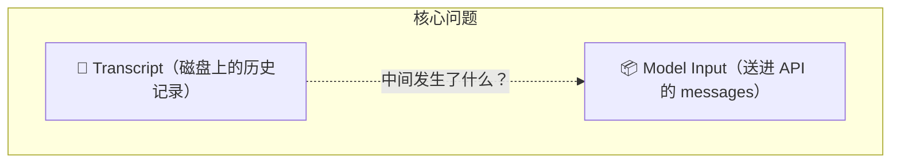
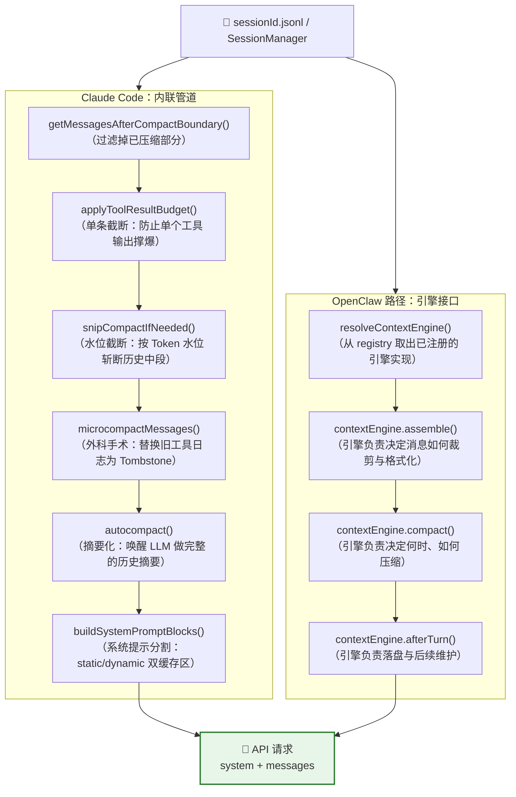

# Context：送进模型的那一包数据，到底是怎么准备出来的？

## 核心问题

> **每次 API 调用之前，引擎从磁盘上的历史记录到最终送进模型的 messages 数组，中间经历了多少层处理？每一层的存在是为了解决什么问题？**

这个问题的答案直接揭示了一个 Agent 系统最核心的"生命保障系统"。Claude Code 和 OpenClaw 在这里给出了截然不同的答案——一个选择将所有逻辑编码在一个精确对齐的数组组装管道里，另一个选择将这个管道本身变成一个可替换的组件。



---

## Context 窗口的物理布局

在讨论"怎么准备"之前，先明确"准备的是什么"——Context 窗口里具体有哪些 Section，它们的顺序和性质是什么。

### Claude Code：严格分区的线性 Section 数组

CC 的 Context 由**三个物理载体**组成：`system`（系统提示数组）、`tools`（工具 Schema 数组，独立顶级参数）和 `messages`（对话消息列表）。

```
┌─────────────────────────────────────────────────────────────────┐
│                    SYSTEM PROMPT（系统提示数组）                   │
│                                                                 │
│  ◆ 静态区 (cacheScope: 'global')  ← 条件成立时跨 org 共享         │
│  ├── [Attribution Header]（计费溯源标记）                          │
│  ├── [CLI Prefix Header]（来源标识）                              │
│  ├── # Intro（角色定义 + 网络安全指令）                             │
│  ├── # System（输出格式规则 / Hook 提示 / 无限上下文说明）           │
│  ├── # Doing tasks（编码规范 / 任务执行规范）                       │
│  ├── # Executing actions with care（危险操作确认规则）              │
│  ├── # Using your tools（工具调用规则 / 并发策略）                  │
│  │     注：此 Section 引用工具名称常量，不含具体工具配置，内容稳定     │
│  ├── # Tone and style（输出风格约束）                              │
│  └── # Output efficiency（简洁性要求）                            │
│                                                                 │
│  ════════ __SYSTEM_PROMPT_DYNAMIC_BOUNDARY__ ════════           │
│  （工程作用：隔离"内容确定"与"内容随会话变化"的 Section）              │
│                                                                 │
│  ◆ 动态区 (cacheScope: null)  ← 会话内相对稳定，但不参与全球缓存    │
│  ├── # Session-specific guidance                                │
│  │     此 Section 由多个运行时 bool 条件拼接，含：                  │
│  │     是否有 Skill 工具、是否非交互 Session、Feature Flag 开关等    │
│  │     任一条件变 → 文本变 → 缓存 hash 变                          │
│  │    （这是它被刻意移到 Boundary 后的工程原因，见源码注释）           │
│  ├── # Memory（用户 CLAUDE.md 的全文注入）                         │
│  │     文件内容改变则此块缓存失效                                   │
│  ├── # Environment（CWD / OS / 模型名 / 会话起始时间）              │
│  │     含路径等私人信息，刻意不放入 global 以防全网缓存碎片化          │
│  ├── # Language（用户语言偏好）                                    │
│  ├── # Output style（如有自定义输出模板）                           │
│  ├── # MCP Server Instructions（已连接 MCP 服务器的文档）           │
│  ├── # Scratchpad instructions（思考过程格式约束）                  │
│  └── … 其他 Feature Flag 控制的可选 Section                       │
│                                                                 │
└─────────────────────────────────────────────────────────────────┘

┌─────────────────────────────────────────────────────────────────┐
│           TOOLS（工具 Schema 数组，API 请求的独立顶级参数）            │
│                                                                 │
│  ├── [内置工具] Bash / FileRead / FileEdit / Glob / Grep ...     │
│  │     内置工具 Schema 固定不变，顺序稳定，是缓存命中的最优候选        │
│  └── [MCP 工具] mcp__server__tool_name ...（按接入配置动态变化）    │
│        一旦存在未被 defer 的 MCP 工具，触发降级逻辑：               │
│        needsToolBasedCacheMarker = true                         │
│        System Prompt 缓存 'global' 降级为 'org'（组织级）          │
│        失去全球共享缓存，仅限组织内复用                              │
│                                                                 │
└─────────────────────────────────────────────────────────────────┘

┌─────────────────────────────────────────────────────────────────┐
│                    MESSAGES（对话消息列表）                         │
│                                                                 │
│  User（system-reminder）                                        │
│  ┌──────────────────────────────────────────────────────────┐  │
│  │ <system-reminder> gitStatus / claudeMd / 其他上下文 </…>  │  │
│  └──────────────────────────────────────────────────────────┘  │
│                                                                 │
│  …重复 N 轮…                                                    │
│  ┌──────────────────┐  ┌────────────────────────────────────┐  │
│  │ User message     │  │ Assistant message                  │  │
│  │ "帮我重构这个函数" │  │ <think>…</think>                   │  │
│  └──────────────────┘  │ 好的，我先读一下文件                │  │
│                         │ tool_use: Read("src/foo.ts")       │  │
│                         └────────────────────────────────────┘  │
│  ┌──────────────────────────────────────────────────────────┐  │
│  │ User message (tool_result)                               │  │
│  │ content: [{ type: 'tool_result', content: '…文件内容…' }] │  │
│  └──────────────────────────────────────────────────────────┘  │
│  ┌────────────────────────────────────────────────────────────┐ │
│  │ Assistant message                                          │ │
│  │ "根据文件内容，建议将 foo() 分解为…"                           │ │
│  └────────────────────────────────────────────────────────────┘ │
│                                                                 │
│  [如果发生 AutoCompact：以上历史被替换为一条摘要 User message]       │
│                                                                 │
└─────────────────────────────────────────────────────────────────┘
```

**缓存策略的真实决策逻辑（基于源码 `claude.ts:1210-1214` 和 `prompts.ts:343-347`）：**

| 内容 | 缓存作用域 | 实际失效条件 |
|------|:---:|:---|
| 静态区 System Prompt（# Intro → # Output efficiency） | `global`（有条件，见下） | CC 版本升级时工程师修改了指令文本 |
| `# Session-specific guidance` | `null` | Skill 列表、Session 类型、Feature Flag 等任一变化 |
| `# Memory`（CLAUDE.md） | `null` | 用户修改了 CLAUDE.md 文件 |
| `# Environment` | `null` | 含路径等私人信息，设计上不参与全球缓存 |
| 内置工具 Schema（`tools` 参数前段） | 受 `tools` 参数整体缓存机制管控 | CC 版本升级导致 Schema 文本变化 |
| MCP 工具 Schema（`tools` 参数后段） | 触发 System Prompt 缓存降级至 `org` | MCP 服务端工具列表变化 |
| Messages 历史 | Session 级别缓存断点（仅末尾一条） | 每轮末尾追加新消息 |

**`global` 缓存的前提条件（源码关键逻辑）：**

```typescript
// MCP tools are per-user → dynamic tool section → can't globally cache.
const needsToolBasedCacheMarker =
  useGlobalCacheFeature &&
  filteredTools.some(t => t.isMcp === true && !willDefer(t))
```

- **未接入 MCP 工具**：System Prompt 静态区以 `scope: 'global'` 缓存，可跨组织命中（不同用户、不同项目，只要 CC 版本一致均可复用）。
- **接入了 MCP 工具**（且未被 Tool Search 功能 defer）：缓存从 `global` **降级为 `org`（组织级）**，失去全网共享收益。
- **Skill 列表变化**：体现在 `# Session-specific guidance` 的文本内容上，该 Section 在动态区，变化只影响自身的 hash，不破坏静态区缓存。

---

### OpenClaw：扁平化 + 可注入的 Section 结构

OC 的系统提示是一个字符串（不是数组），由 `buildAgentSystemPrompt()` 一次性拼接，Section 顺序固定但内容依赖传入参数按需生成：

```
┌─────────────────────────────────────────────────────────────────┐
│                    SYSTEM PROMPT（单字符串）                       │
│                                                                 │
│  You are a personal assistant running inside OpenClaw.          │
│                                                                 │
│  ## Tooling（可用工具列表，按策略过滤后生成）                        │
│  ## Tool Call Style（工具调用风格约束）                             │
│  ## Safety（安全约束：无独立目标 / 人类监督优先）                    │
│  ## OpenClaw CLI Quick Reference                                │
│  ## Skills（如果配置了 Skills，在此注入 SKILL.md 摘要）            │
│  ## Memory（memory-state 插件输出 / citation 模式控制）            │
│  ## OpenClaw Self-Update（gateway 工具可用时）                    │
│  ## Model Aliases（模型别名映射表）                                │
│  ## Workspace（工作目录路径 + 安全操作指引）                        │
│  ## Documentation（OC Docs 路径 + 外部链接）                      │
│  ## Authorized Senders（owner 白名单，hash 或 raw）               │
│  ## Current Date & Time（用户时区）                               │
│  ## Workspace Files (injected)（告知 Project Context 的入口）     │
│  ## Messaging（消息路由 + message 工具指引）                       │
│  ## Voice / TTS（语音提示，可选）                                  │
│  ## Subagent Context / Group Chat Context                       │
│    └── extraSystemPrompt（调用方注入，可携带 RAG 结果、角色设定）    │
│  ## Silent Replies（空回复协议）                                   │
│  ## Heartbeats（定时检查协议，可选）                                │
│  ## Runtime（模型名 / OS / node / channel / 推理级别）             │
│                                                                 │
│  # Project Context（contextFiles 注入，每个 CLAUDE.md 等）        │
│  ## path/to/CLAUDE.md                                           │
│    [文件全文]                                                    │
│  ## path/to/SOUL.md                                             │
│    [文件全文]                                                    │
│                                                                 │
│  ┄ ContextEngine.assemble() 返回的 systemPromptAddition 追加 ┄   │
│                                                                 │
└─────────────────────────────────────────────────────────────────┘

┌─────────────────────────────────────────────────────────────────┐
│                    MESSAGES（由 Pi SDK 管理）                     │
│  结构与 CC 类似（user/assistant 交替）                              │
│  工具调用同样嵌入 assistant message 的 content 数组                 │
│  关键差异：历史记录由 SessionManager + contextEngine.assemble()     │
│            共同决定哪些轮次送进模型                                  │
└─────────────────────────────────────────────────────────────────┘
```

**CC vs OC Section 结构的核心差异：**

| 维度 | Claude Code | OpenClaw |
|------|-------------|---------|
| 系统提示形态 | `string[]` 数组，每个元素一个 Section | 单个 `string`，全部拼接 |
| 缓存分区 | Boundary 标记分为 static/dynamic 两组 | 无内置分区，统一由 Pi SDK 缓存策略决定 |
| 工具 Schema | 完整 JSON Schema 嵌入系统提示静态区 | 工具摘要（2-10 词描述）嵌入系统提示，完整 Schema 在 Pi SDK 层传递 |
| 项目文档注入 | `# Memory`（只含 CLAUDE.md / `.claude/` 目录） | `# Project Context`（任意 contextFiles，包括 SOUL.md 等） |
| 动态追加 | `resolvedDynamicSections` 在 Boundary 后追加 | `contextEngine.assemble()` 返回的 `systemPromptAddition` 拼接到末尾 |

---

## 概念全景图：Context 的完整地图

在深入每一层之前，先看一张完整的概念地图：从原始历史记录到最终 API 请求，在这段距离里，哪些因素会干预数据，它们各自在什么位置？



**怎么读这张图：**

- **CC 是直线管道**：每一步都是函数调用，顺序固定，每个函数直接操作 `Message[]` 数组。
- **OC 是接口调度**：`resolveContextEngine()` 先从注册表里取出引擎，后续所有操作通过接口调用转发给引擎实现。
- **两条路都汇入同一个终点**：一个 `system prompt array` + 一个 `messages array`，格式化为 API 请求。

---

## 设计解读：每一层解决什么问题

### 第 1 层：系统提示的"静/动"两分——Cache 经济学

> **这层解决的问题**：大模型 API 的系统提示往往极为庞大（包含所有工具 Schema + 使用指南），如果每轮都把整段文本送出去让服务端重新处理，API 成本将极其昂贵。

**Claude Code 的解法**：用一个字面量标记 `SYSTEM_PROMPT_DYNAMIC_BOUNDARY = '__SYSTEM_PROMPT_DYNAMIC_BOUNDARY__'` 把系统提示数组一分为二。

```typescript
// claude-code/src/constants/prompts.ts#L114
// WARNING: Do not remove or reorder this marker without updating cache logic in:
// - src/utils/api.ts (splitSysPromptPrefix)
// - src/services/api/claude.ts (buildSystemPromptBlocks)
export const SYSTEM_PROMPT_DYNAMIC_BOUNDARY = '__SYSTEM_PROMPT_DYNAMIC_BOUNDARY__'
```

`splitSysPromptPrefix()` 在 API 调用前扫描系统提示数组，找到这个 Boundary 后：

- **Boundary 之前**（`cacheScope: 'global'`）：绝对不变的内容——`# Doing tasks`（编码约束），全量工具 Schema（Bash、FileRead、Glob 等所有工具的 JSON 定义）。这一块标记为 `global` scope 的跨组织共享缓存。
- **Boundary 之后**（`cacheScope: null`，不缓存）：**每轮必变**的内容——`# Session-specific guidance`（根据当前工具集动态生成），`# Memory`（当前 CLAUDE.md 注入），`# Environment`（CWD、时间、OS 等），`# Language`（用户偏好）。

```typescript
// claude-code/src/utils/api.ts#L380-L396
// 只有边界前的块被标记为 global 缓存
if (i < boundaryIndex) {
  staticBlocks.push(block)   // → cacheScope: 'global'
} else {
  dynamicBlocks.push(block)  // → cacheScope: null（不缓存）
}
```

> **设计洞察**：Anthropic 的 Prompt Cache 要求前缀必须**字节完全一致**才命中。哪怕是时区偏移导致的时间戳变化，或者工具权限变化导致的 Session Guidance 更新，都会让缓存全盘失效。Boundary 的本质是**隔离区**：把一切"可能随时间或用户状态变化的东西"驱逐出静态区，让静态区的巨大工具 Schema（通常超过 60KB）可以被永久缓存命中。

**OpenClaw 的对应设计**：系统提示的分区策略由 `buildEmbeddedSystemPrompt()` 在 `attempt.ts` 中完成，逻辑类似，但结果通过 `contextEngine.assemble()` 的返回结果中的 `systemPromptAddition` 字段注入——引擎可以在 assemble 阶段为本轮追加额外的系统提示片段。

---

### 第 2 层：工具日志的预算控制——防止单次爆炸

> **这层解决的问题**：一次 `Read(large_file.ts)` 可能返回几万字节的内容。如果不拦截，单个工具调用就能把 Context Window 的大半消耗殆尽。

**Claude Code**：`applyToolResultBudget()` 在每轮推理前对 `messagesForQuery` 做**消费量检查**。每个工具有独立的 `maxResultSizeChars` 配置（设置了 `maxResultSizeChars` 的工具会被豁免，否则统一受全局 Budget 约束）。超限的工具结果被截断，并以 Tombstone 替换：`[Content truncated: X characters over budget]`。

```typescript
// claude-code/src/query.ts#L379-L394
messagesForQuery = await applyToolResultBudget(
  messagesForQuery,
  toolUseContext.contentReplacementState,
  persistReplacements ? records => void recordContentReplacement(...) : undefined,
  new Set(toolUseContext.options.tools
    .filter(t => !Number.isFinite(t.maxResultSizeChars))
    .map(t => t.name)),
)
```

> **设计洞察**：截断后的内容会被持久化写入 `contentReplacementState` 并记录到会话文件中（通过 `recordContentReplacement`）。这意味着当用户 `/resume` 恢复会话时，截断信息能够被还原，下一轮的 API 调用不会再重新计算截断范围。这是一个成本控制和 Resume 一致性之间精妙的双赢设计。

**OpenClaw**：Token 配额由 `contextEngine.assemble()` 的 `tokenBudget` 参数传入，引擎自行决定如何执行约束。不同的引擎实现可以有不同的截断策略——比如一个面向语音应用的引擎可以优先保留对话型消息，丢弃工具日志；而内置的 `LegacyContextEngine` 则直接放行（return `{ messages: params.messages }`），把配额控制的责任完全交给运行时的上游逻辑。

---

### 第 3 层：Snip——水位截断，保头保尾

> **这层解决的问题**：当整体 Token 数触达 Context Window 的警戒水位，但 AutoCompact 还没有触发（或者被禁用了），需要一个临时的"减压阀"。

**Claude Code**：`snipCompactIfNeeded()` 是一个暴力手段——它扫描消息历史，把中段老旧的问答轮次直接切除，**只保留最开头的系统消息片段和最近的若干轮对话**，插入一个 Boundary 标记表示"这里曾经有内容被删除"。

- 代价：**中段对话永远丢失**，模型看不到这些内容存在过
- 目的：瞬间买回足够的 Token 空间，让当前这轮推理能够正常发起

```typescript
// claude-code/src/query.ts#L401-L410
if (feature('HISTORY_SNIP')) {
  const snipResult = snipModule!.snipCompactIfNeeded(messagesForQuery)
  messagesForQuery = snipResult.messages
  snipTokensFreed = snipResult.tokensFreed  // 传给 autocompact 作为减量参考
}
```

> **设计洞察**：Snip 和 AutoCompact 不是互斥的，它们在同一轮循环中**可以都触发**——先 Snip 腾出空间，再 AutoCompact 把剩余内容整理成摘要。`snipTokensFreed` 被刻意传给了 autocompact 的触发阈值计算，防止这种情况：Snip 后 Token 数已经降到阈值以下，但 autocompact 用了 Snip 之前的旧统计值，以为还需要再压缩。

---

### 第 4 层：Microcompact（Tombstone 机制）——外科手术，不动骨架

> **这层解决的问题**：工具日志是最大的 Token 消耗源，但对话骨架（推理结论、决策记录）是有价值的。能不能只清除日志，保留对话结构？

**Claude Code**：`microcompactMessages()` 不删消息，不改对话结构——它遍历历史，定位那些消耗大量 Token 的**特定工具的结果**（`COMPACTABLE_TOOLS = Set{FileRead, Bash, Grep, Glob, WebSearch, WebFetch, FileEdit, FileWrite}`），将其内容替换为字面量字符串 `'[Old tool result content cleared]'`，同时保留消息ID和位置不变。

```typescript
// claude-code/src/services/compact/microCompact.ts#L41-L50
const COMPACTABLE_TOOLS = new Set<string>([
  FILE_READ_TOOL_NAME,      // 文件读取
  ...SHELL_TOOL_NAMES,      // Bash/Shell
  GREP_TOOL_NAME,           // 文件搜索
  GLOB_TOOL_NAME,           // 路径匹配
  WEB_SEARCH_TOOL_NAME,     // 网页搜索
  WEB_FETCH_TOOL_NAME,      // 网页抓取
  FILE_EDIT_TOOL_NAME,      // 文件编辑
  FILE_WRITE_TOOL_NAME,     // 文件写入
])
```

更精妙的是 **Cached Microcompact**（限一方用户）：它不直接修改本地消息内容，而是向 API 发送额外的 `cache_edits` 指令，让服务端在**不破坏 Prompt Cache 的前提下**删除缓存中的旧工具内容。本地消息不变，下次请求发过去的 API 参数里带着"删掉 toolId: abc 的缓存"——这意味着 Tombstone 手术是在服务端执行的，本地历史保持干净。

> **设计洞察**：常规 Microcompact 修改本地消息 → **Prompt Cache 必然失效**（内容变了）。Cached Microcompact 不改本地消息 → **Prompt Cache 继续命中**，只是告诉服务端"那个工具的缓存内容你可以删了"。代价是每次 API 请求都要携带 `cache_edits` 元信息，收益是避免了因 Tombstone 替换而触发的缓存重建费用。选择哪条路，取决于服务商是否支持 Cache Editing API。

---

### 第 5 层：AutoCompact——最终大招，全量摘要

> **这层解决的问题**：前四层都是"外科手术"——精准截断、局部替换。但有时候历史实在太长，外科手术已无济于事，只能"大脑换芯"——让一个 LLM 把整段对话历史重写成一段精炼的摘要，用摘要替换所有历史消息。

**Claude Code**：`autocompact()` 在每轮推理前检查当前 token 数是否超过阈值（由 `calculateTokenWarningState()` 判定），如果超过，则：

1. 另起一个内部 LLM 调用（一般用轻量级 Haiku）
2. 对当前 `messagesForQuery` 进行归纳压缩
3. 生成的摘要文本作为新的消息历史第一条
4. 后续对话附加在摘要之后继续

```typescript
// claude-code/src/query.ts#L453-L467
const { compactionResult, consecutiveFailures } = await deps.autocompact(
  messagesForQuery,
  toolUseContext,
  { systemPrompt, userContext, systemContext, toolUseContext, forkContextMessages: messagesForQuery },
  querySource,
  tracking,
  snipTokensFreed,   // ← Snip 腾出的空间已经算在里面
)
```

失败有保护：`consecutiveFailures` 计数，多次连续失败后停止重试，交由外部触发的 `/compact` 命令接手。

**OpenClaw**：`contextEngine.compact()` 是对应接口。内置的 `LegacyContextEngine` 把实现委托给 `delegateCompactionToRuntime()`，最终路径和 CC 的 AutoCompact 逻辑一致。区别在于：OC 的引擎可以**重载** `compact()` 实现自己的压缩策略——比如"保存最近 50 轮问答的完整记录，只压缩超出 50 轮的部分"，而这种差异化策略在 CC 里是不可能不改核心代码就做到的。

---

### 第 6 层：Context Engine 注册机制——CC 和 OC 的架构分歧点

> **这层解决的问题**：如果你想把 Context 管理的"数据库"从本地 JSON 文件换成 Redis、换成向量数据库（RAG），或者你想针对不同的模型用不同的消息格式（OpenAI 的消息格式和 Anthropic 的不同），CC 和 OC 的加法难度有多大？

**Claude Code：无接口，直接操作数组**

CC 的 Context 流转全部在 `query.ts` 的 `queryLoop()` 内，以**函数调用串联**的方式内嵌：

```typescript
// claude-code/src/query.ts#L365
let messagesForQuery = [...getMessagesAfterCompactBoundary(messages)]
// 然后依次调用 applyToolResultBudget → snip → microcompact → autocompact
```

所有函数都直接引用 `Message[]` 类型——这是 Anthropic SDK 的原生消息类型。如果你想接入 OpenAI API，你需要把这个数组里的每一个 `ToolResultBlockParam` 格式换成 OpenAI 的格式，改动将蔓延至整个 query 和 compact 子系统。

**OpenClaw：三层注册机制**

OC 提取了 `ContextEngine` 接口（`src/context-engine/types.ts`），并通过 `registerContextEngineForOwner()` / `registerContextEngine()` 构建了一个**进程全局注册表**：

```typescript
// openclaw/src/context-engine/registry.ts#L345-L367
export function registerContextEngineForOwner(
  id: string,
  factory: ContextEngineFactory,  // () => ContextEngine | Promise<ContextEngine>
  owner: string,
  opts?: { allowSameOwnerRefresh?: boolean }
): ContextEngineRegistrationResult {
  // ...
  registry.set(id, { factory, owner: normalizedOwner })
  return { ok: true }
}
```

在运行时，`resolveContextEngine()` 读取 config 中的插槽配置（`config.plugins.slots.contextEngine`），从注册表找到对应的工厂函数，创建引擎实例：

```typescript
// openclaw/src/context-engine/registry.ts#L411-L427
export async function resolveContextEngine(config?: OpenClawConfig): Promise<ContextEngine> {
  const slotValue = config?.plugins?.slots?.contextEngine
  const engineId = typeof slotValue === 'string' && slotValue.trim()
    ? slotValue.trim()
    : defaultSlotIdForKey('contextEngine')  // 默认值是 "legacy"

  const entry = getContextEngineRegistryState().engines.get(engineId)
  if (!entry) throw new Error(`Context engine "${engineId}" is not registered...`)
  return wrapContextEngineWithSessionKeyCompat(await entry.factory())
}
```

> **设计洞察**：OC 的注册表是**进程全局单例**（`Symbol.for("openclaw.contextEngineRegistryState")`）。这个设计刻意为之，是为了在同一个 Node.js 进程里多次 `require()` 相同模块时（npm 多版本场景），所有副本都共享同一个注册中心，防止引擎注册丢失。不同的引擎可以服务同一进程内的不同 Session，而 CC 的单函数管道在同一进程里只有一套逻辑。

---

## 两边怎么做：差异的根本原因

| 维度 | Claude Code | OpenClaw Agent Runtime | 差异原因 |
|------|-------------|----------------------|----------|
| Context 管道形态 | 内联函数调用链（`query.ts` 直接串联） | 接口调度（`resolveContextEngine()` + 调用方法） | CC 是单体 CLI，OC 是多租户网关 |
| 工具日志清除 | Tombstone 替换 / Cached MC（Cache Editing） | 委托 `contextEngine.compact()` 实现 | CC 追求极致缓存命中率，OC 留出替换空间 |
| 模型格式适配 | 写死为 Anthropic SDK 格式（`Message[]`） | `assemble()` 可按 `model` 参数输出不同格式 | CC 只服务 Anthropic，OC 要服务多个提供商 |
| 外部记忆接入 | 无接口，需改 query.ts + compact 子系统 | 实现 `ContextEngine`，在 `ingest`/`assemble` 拦截 | CC 没有企业级网关需求 |
| 压缩策略定制 | 固定：Budget→Snip→MC→AutoCompact | 引擎可完全重写 `compact()` 逻辑 | OC 支持第三方插件生态 |
| 系统提示分区 | Boundary 字面量标记（`__SYSTEM..._BOUNDARY__`） | `systemPromptAddition` 字段在 `assemble` 结果注入 | 相同的目标（缓存隔离），不同的实现形式 |

---

## 场景演练：同一个「读取了一个 10 万字节文件」的工具调用，下一轮推理前发生了什么？

**在 Claude Code 中**：

1. `getMessagesAfterCompactBoundary()` → 过滤出当前对话分支的消息
2. `applyToolResultBudget()` → 检测到这个 FileRead 结果超过 `maxResultSizeChars` → **截断**，本地写入 `contentReplacementState`
3. `snipCompactIfNeeded()` → Token 水位检查，如果仍正常，不触发
4. `microcompactMessages()` → 如果此前若干轮还有其他旧的 FileRead/Bash 结果 → 把它们的内容替换为 `'[Old tool result content cleared]'`（或通过 `cache_edits` 让服务端删除）
5. `autocompact()` → 如果 Token 总量仍然超过阈值 → 唤醒轻量级 LLM 做摘要
6. `buildSystemPromptBlocks()` → 按 Boundary 切割系统提示，静态区标记 `global` cache scope

**在 OpenClaw 中**：

1. `resolveContextEngine(config)` → 从注册表取出 `LegacyContextEngine`（或配置中指定的引擎）
2. `contextEngine.assemble({ messages, tokenBudget, model })` → 引擎按 tokenBudget 约束整理消息，`LegacyContextEngine` 直接透传（`pi-coding-agent` 层面的 SessionManager 在更上游已经做过处理）
3. 本轮 LLM 推理结束后，`contextEngine.afterTurn(...)` → 引擎自行决定是否触发 `compact()` 以及落盘方式

**两边都到达了相同的终点**：一个不超过 Context Window 的 `messages` 数组 + 一个分了缓存区的 `system prompt`，打包成 API 请求。

---

## 源码定位

### Claude Code
| 文件 | 关键内容 |
|------|---------| 
| [constants/prompts.ts#L114](../03-claude-code-runnable/src/constants/prompts.ts#L114) | `SYSTEM_PROMPT_DYNAMIC_BOUNDARY` 定义与注释 |
| [utils/api.ts#L321](../03-claude-code-runnable/src/utils/api.ts#L321) | `splitSysPromptPrefix()` — 按 Boundary 切割并打 cache scope 标签 |
| [query.ts#L365](../03-claude-code-runnable/src/query.ts#L365) | `messagesForQuery` 四步过滤管道的入口 |
| [query.ts#L379](../03-claude-code-runnable/src/query.ts#L379) | `applyToolResultBudget()` — 单条工具结果截断 |
| [query.ts#L401](../03-claude-code-runnable/src/query.ts#L401) | `snipCompactIfNeeded()` — 水位截断 |
| [services/compact/microCompact.ts#L41](../03-claude-code-runnable/src/services/compact/microCompact.ts#L41) | `COMPACTABLE_TOOLS` — 哪些工具的结果会被 Tombstone |
| [services/compact/microCompact.ts#L253](../03-claude-code-runnable/src/services/compact/microCompact.ts#L253) | `microcompactMessages()` — Tombstone 机制主逻辑 |
| [query.ts#L453](../03-claude-code-runnable/src/query.ts#L453) | `deps.autocompact()` — LLM 摘要压缩触发点 |

### OpenClaw
| 文件 | 关键内容 |
|------|---------|
| [context-engine/types.ts#L104](../openclaw/src/context-engine/types.ts#L104) | `ContextEngine` 接口完整定义（bootstrap/ingest/assemble/compact/afterTurn） |
| [context-engine/registry.ts#L345](../openclaw/src/context-engine/registry.ts#L345) | `registerContextEngineForOwner()` — 引擎注册 |
| [context-engine/registry.ts#L411](../openclaw/src/context-engine/registry.ts#L411) | `resolveContextEngine()` — 按插槽配置解析并返回引擎实例 |
| [context-engine/legacy.ts#L21](../openclaw/src/context-engine/legacy.ts#L21) | `LegacyContextEngine` — 默认引擎，透传 assemble，compact 委托给运行时 |
| [pi-embedded-runner/run/attempt.context-engine-helpers.ts#L53](../openclaw/src/agents/pi-embedded-runner/run/attempt.context-engine-helpers.ts#L53) | `assembleAttemptContextEngine()` — 每轮推理前调用引擎的 assemble |
| [pi-embedded-runner/run/attempt.context-engine-helpers.ts#L75](../openclaw/src/agents/pi-embedded-runner/run/attempt.context-engine-helpers.ts#L75) | `finalizeAttemptContextEngineTurn()` — 每轮结束后的 ingest + afterTurn + maintain |
