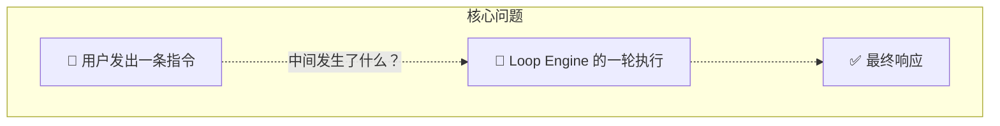
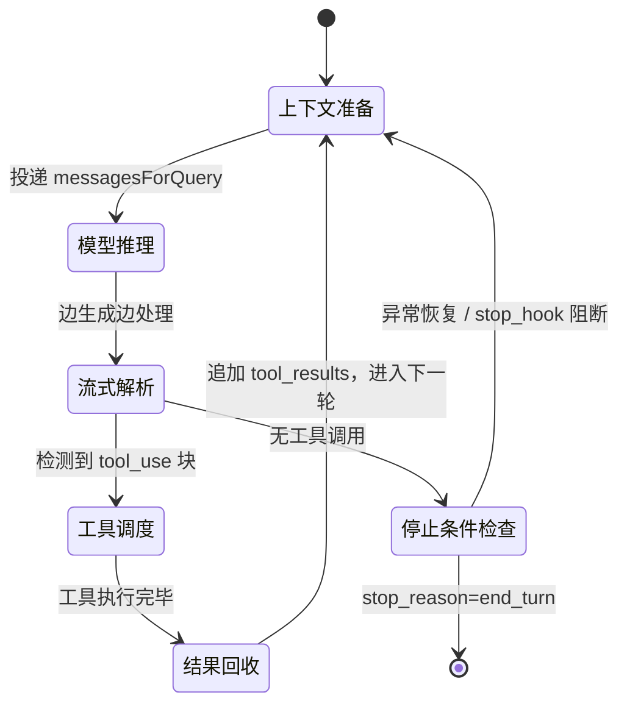

# Loop Engine：一轮对话里到底发生了多少次推理？

## 核心问题

> **用户发了一条「帮我重构这个模块」，模型在一轮响应里究竟调用了多少次 API，工具是怎么排队执行的，什么时候才算真的「结束」？**

这个问题的答案直接决定了 Agent 系统的性能边界和故障模式。Claude Code 和 OpenClaw 对这个问题给出了截然不同的答案——一个选择了**极致的流式并发**，另一个选择了**可组合的重试状态机**。



---

## 概念全景图：一轮 `while(true)` 的完整剖析

在深入细节之前，先看清楚一轮 Loop 的骨架。两个系统的循环结构高度一致，但在**每一个关键节点**的实现策略上分道扬镳：



**几个容易混淆的边界：**

| 概念 | 它是一次 API 调用吗？ | 说明 |
|------|:---:|------|
| 一次「工具调用」 | 否 | 工具是本地执行的，结果写回消息再发给模型 |
| 一轮「循环迭代」 | 是 | 每次 `while(true)` 顶部触发一次新的 API 请求 |
| AutoCompact 压缩 | 是 | 会单独触发一次内部 LLM 摘要请求 |
| 用户按 ESC 打断 | 否 | Abort 信号注入，不新增 API 调用 |

---

## 设计解读：每一层解决什么问题

### 第 1 层：上下文准备——每轮推理的起点

每次循环进入，第一件事是从消息数组中构建本轮的 `messagesForQuery`。这不是原始 Transcript 的简单复制，而是一套完整的**上下文过滤管道**。

**执行顺序是严格固定的（不可乱序）：**

```typescript
// claude-code/src/query.ts#L365-L467
// 1. 裁剪单条工具结果（防止单个 Bash stdout 撑爆）
messagesForQuery = await applyToolResultBudget(messagesForQuery, ...)

// 2. Snip：按 token 水位斩断旧历史（保头保尾丢中间）
messagesForQuery = snipModule.snipCompactIfNeeded(messagesForQuery).messages

// 3. Microcompact：外科手术替换大体积的工具日志为 Tombstone
messagesForQuery = await deps.microcompact(messagesForQuery, ...).messages

// 4. AutoCompact：如果前三步仍超阈值，唤醒独立 LLM 做完整摘要
const { compactionResult } = await deps.autocompact(messagesForQuery, ...)
```

> **设计洞察**：顺序严格的原因在于这四步是**互补而非重叠的**。Microcompact 用 `tool_use_id` 做精确定位（不读内容），所以必须在 `applyToolResultBudget` 内容替换之后运行，才能保证两者的缓存键不冲突。如果乱序，缓存会因字节失配而全部失效。

这一层在 OpenClaw 中由 `contextEngine.assemble()` 封装（详见 [02-context.md](./02-context.md)），两边做的事相同，但 OC 通过接口实现了更换底层实现的可能。

---

### 第 2 层：流式解析——模型推理不是等到最后再读

这是 Claude Code 和 OpenClaw 在工程哲学上的**第一个关键分歧**。

**Claude Code：Async Generator + 流式工具执行**

CC 用 `async function*` 把整个 `query()` 变成一个 AsyncGenerator。模型的每一个输出块（思考段落、文本、工具调用结构体）都通过 `yield` 实时推给上层的 UI（Ink 终端渲染器）。

更激进的是：CC 在模型**还没输出完整的 `tool_use` JSON**时，就开始并发执行工具——

```typescript
// claude-code/src/services/tools/StreamingToolExecutor.ts#L76-L124
// 只要检测到 tool_use 块的头部（name 已知），立刻 addTool() 进队列
addTool(block: ToolUseBlock, assistantMessage: AssistantMessage): void {
  // ...
  void this.processQueue()   ← 立刻尝试启动执行
}

// 在主流式循环的每一帧，都去捞已完成的工具结果
for (const result of streamingToolExecutor.getCompletedResults()) {
  yield result.message  ← 工具结果先于模型输出完成而 yield 出来
}
```

这意味着当模型还在生成第 3 个工具调用的 JSON 时，第 1 个工具（比如 `Bash`）可能已经执行完毕并把结果写回消息。这是专为本地 CLI 设计的极致延迟优化——流式生成和工具执行**完全重叠**，用户看到第一条工具输出的时间大幅缩短。

**OpenClaw：`subscribeEmbeddedPiSession` + Hook 总线**

OC 不使用 Generator，而是通过 `subscribeEmbeddedPiSession` 注册一系列回调：`onPartialReply`, `onBlockReply`, `onToolResult`。模型输出被转换成事件推入 Hook Runner，由外挂插件订阅。

这个设计的代价是**无法做流式工具执行**（回调不能中途修改还在推进的流），但换来的是能在 `before_compaction` / `after_compaction` 等生命周期节点注入任意业务逻辑——比如在 AutoCompact 前把重要的消息写入外部数据库备份。

---

### 第 3 层：工具调度——并发还是串行？

工具执行是循环的核心 IO 操作，两边的并发策略差异最为显著。

**Claude Code：细粒度并发控制（`isConcurrencySafe`）**

CC 的 `StreamingToolExecutor` 把工具分成两类：

```typescript
// claude-code/src/services/tools/StreamingToolExecutor.ts#L129-L135
private canExecuteTool(isConcurrencySafe: boolean): boolean {
  const executingTools = this.tools.filter(t => t.status === 'executing')
  return (
    executingTools.length === 0 ||
    (isConcurrencySafe && executingTools.every(t => t.isConcurrencySafe))
  )
}
```

- **并发安全工具**（`isConcurrencySafe = true`）：读文件、抓网页——可以全部并行
- **独占工具**（`isConcurrencySafe = false`）：写文件、执行 Bash——必须排队串行

更关键的是 **Bash 错误的级联中止**：只要一个 Bash 命令出错，`siblingAbortController` 立刻向所有并行工具发出中止信号——代码里明确保留了 `Bash` 的特权，因为"mkdir 失败 → 后续命令都没意义"是Bash工具链的隐式依赖特性：

```typescript
// StreamingToolExecutor.ts#L354-L362
if (tool.block.name === BASH_TOOL_NAME) {
  this.hasErrored = true
  this.siblingAbortController.abort('sibling_error')  // 取消所有兄弟工具
}
```

**OpenClaw：通过 `pi-coding-agent` 的 `runTools()` 统一调度**

OC 将工具编排交给 Pi SDK 的 `runTools()` 处理。工具的并发策略由 `pi-coding-agent` 层面的调度器决定，OC 本身不介入。这使得 OC 更容易接入新的工具类型（只需注册，不需要实现并发安全性判断），但也意味着它放弃了像 CC 那样"Bash 出错级联中止"的精细化控制。

---

### 第 4 层：停止条件——什么叫「真正结束」？

模型返回 `end_turn` 并非总是意味着循环终止。CC 在 `!needsFollowUp` 分支里建立了一套精密的**恢复优先级链**：

```
end_turn 信号 →
  1. 检查是否是被扣押的 prompt_too_long？→ 先尝试 Context Collapse drain → 再尝试 ReactiveCompact
  2. 检查是否是 max_output_tokens 截断？→ 先尝试提升 max_tokens 到 64k → 再注入续写指令最多重试 3 次
  3. 执行 Stop Hooks（用户自定义脚本）→ 成功则结束 → 阻断则追加错误消息再次循环
  4. 检查 Token Budget → 如果未达目标则注入"继续"指令
  5. 真正的 return { reason: 'completed' }
```

这条链的设计原则很清晰：**把所有可以在模型侧恢复的错误，都在循环内部默默处理掉**，避免把中间态暴露给上层 SDK 调用者（否则上层看到 `error` 字段会直接终止整个 Session）。

**OC 的对应设计**：`runEmbeddedPiAgent()` 的外层 `while(true)` 处理的是**运行级别**的重试（认证轮换、Failover 切模型、超时引发的 AutoCompact），而单次 attempt 内部的停止判断委托给 Pi SDK。两层循环的职责清晰分离。

---

### 第 5 层：异常恢复——循环不崩溃的护盾

这是两边差异最具说服力的地方：**CC 的异常处理内嵌在 Generator 循环状态里，OC 的异常处理是外层重试状态机**。

**Claude Code：`state = { ..., transition }` 携带恢复原因**

CC 的整个 `queryLoop` 共享一个可变的 `State` 对象。每次需要「重试」时，不是重新调用函数，而是修改 `state` 并 `continue`，让下一次循环迭代从修改后的状态重新开始。`state.transition` 记录了为什么继续（`'max_output_tokens_recovery'`, `'reactive_compact_retry'` 等），主要用于测试断言和防止死循环。

```typescript
// claude-code/src/query.ts#L1231-L1251
const next: State = {
  messages: [...messagesForQuery, ...assistantMessages, recoveryMessage],
  maxOutputTokensRecoveryCount: maxOutputTokensRecoveryCount + 1,
  transition: { reason: 'max_output_tokens_recovery', attempt: ... },
  // ...
}
state = next
continue   ← 不是 return，而是继续同一个 while(true)
```

**OpenClaw：外层 `runLoopIterations` 计数器 + `FailoverError` 抛出边界**

OC 的外层循环用一个简单的计数器守护：

```typescript
// openclaw/src/agents/pi-embedded-runner/run.ts#L442-L473
if (runLoopIterations >= MAX_RUN_LOOP_ITERATIONS) {
  // 超过最大重试次数 → 返回错误响应，不再重试
  return { payloads: [{ text: "Request failed after repeated internal retries...", isError: true }] }
}
runLoopIterations += 1
const attempt = await runEmbeddedAttempt(...)
```

每次 attempt 结果回来后，外层循环检查：是否超时？是否 Context 溢出？是否需要轮换认证 Profile？并决策是否用新参数再调用一次 `runEmbeddedAttempt()`。**两层循环的边界非常清楚**：`runEmbeddedAttempt` 处理单次 LLM 交互，`runEmbeddedPiAgent` 的外层循环处理跨 attempt 的故障转移。

---

## 两边怎么做：差异的根本原因

| 维度 | Claude Code | OpenClaw Agent Runtime | 差异原因 |
|------|-------------|----------------------|----------|
| 流式处理 | AsyncGenerator，边推边消费 | 回调 Hook 总线，事件驱动 | CC 是单终端渲染，OC 是多下游分发 |
| 工具执行时机 | **流式并发**：模型未完成即开始执行 | 等 attempt 返回后批量执行 | CC 优化本地延迟，OC 优化可观测性 |
| 工具并发控制 | CC 自实现（`isConcurrencySafe` + 级联中止） | 委托 Pi SDK 的 `runTools()` | CC 追求精细控制，OC 追求可扩展 |
| 异常恢复粒度 | Generator 内 `state.transition` 状态机 | 外层独立 while 循环 + Failover 抛出 | CC 所有恢复在一个函数内，OC 分层解耦 |
| 循环终止守卫 | `MAX_OUTPUT_TOKENS_RECOVERY_LIMIT = 3` | `MAX_RUN_LOOP_ITERATIONS` | 两边都有断路器，但粒度不同 |
| Stop Hook 支持 | 内置 `handleStopHooks()`（用户脚本） | 插件 HookRunner（`getGlobalHookRunner()`） | 同一概念，接入方式不同 |

---

## 典型场景演练：「帮我重构这个模块」

**在 Claude Code 中**，一轮执行可能是：

1. `while(true)` 第 1 轮：prepare → 模型开始流式输出 → 检测到 `Read(file.ts)` 指令 → **StreamingToolExecutor 立刻开始读文件**（同时模型继续生成后续工具调用）→ 读完的结果立刻 yield 给 UI → 全部工具完成 → 追加 `tool_results` 进 `messages`
2. `while(true)` 第 2 轮：带着工具结果的 messages 再次送入模型 → 模型输出修改建议 → `end_turn` → `handleStopHooks()` → `return { reason: 'completed' }`

**在 OpenClaw 中**，同样的场景是：

1. 外层 `runEmbeddedPiAgent` 调用 `runEmbeddedAttempt(params)`
2. `attempt.ts` 内部：构建 System Prompt → `contextEngine.assemble()` 准备消息 → 调用 Pi SDK streaming → 收集工具调用请求 → Pi SDK 的 `runTools()` 执行工具 → 追加结果 → 再次 LLM → `end_turn` → `contextEngine.afterTurn()` 落盘
3. 结果返回给外层 → 外层检查没有异常 → 返回最终响应

**两边都完成了任务，但 CC 的总延迟更低**（工具和推理重叠），**OC 的生命周期更可观测**（每个 Hook 点都有明确的插入机会）。

---

## 源码定位

### Claude Code
| 文件 | 关键内容 |
|------|---------| 
| [query.ts#L241](../03-claude-code-runnable/src/query.ts#L241) | `queryLoop()` — 主循环入口，`while(true)` 在此 |
| [query.ts#L365](../03-claude-code-runnable/src/query.ts#L365) | `messagesForQuery` 的四步过滤管道（Budget → Snip → Microcompact → AutoCompact） |
| [query.ts#L562](../03-claude-code-runnable/src/query.ts#L562) | `StreamingToolExecutor` 初始化，流式工具并发开启时机 |
| [query.ts#L1062](../03-claude-code-runnable/src/query.ts#L1062) | `!needsFollowUp` 分支：停止条件的完整恢复优先级链 |
| [StreamingToolExecutor.ts#L40](../03-claude-code-runnable/src/services/tools/StreamingToolExecutor.ts#L40) | 流式并发执行器：`isConcurrencySafe` 策略 + Bash 级联中止 |

### OpenClaw
| 文件 | 关键内容 |
|------|---------|
| [pi-embedded-runner/run.ts#L441](../openclaw/src/agents/pi-embedded-runner/run.ts#L441) | 外层 `runLoopIterations` 守卫 + `runEmbeddedAttempt` 调用 |
| [pi-embedded-runner/run/attempt.ts#L331](../openclaw/src/agents/pi-embedded-runner/run/attempt.ts#L331) | `runEmbeddedAttempt()` — 单次 attempt 的全流程 |
| [pi-embedded-subscribe.ts](../openclaw/src/agents/pi-embedded-subscribe.ts) | `subscribeEmbeddedPiSession` — 回调 Hook 总线的注册机制 |
| [pi-embedded-runner/run.ts#L390](../openclaw/src/agents/pi-embedded-runner/run.ts#L390) | `resolveContextEngine` + AutoCompact 触发路径（overflow / timeout） |
