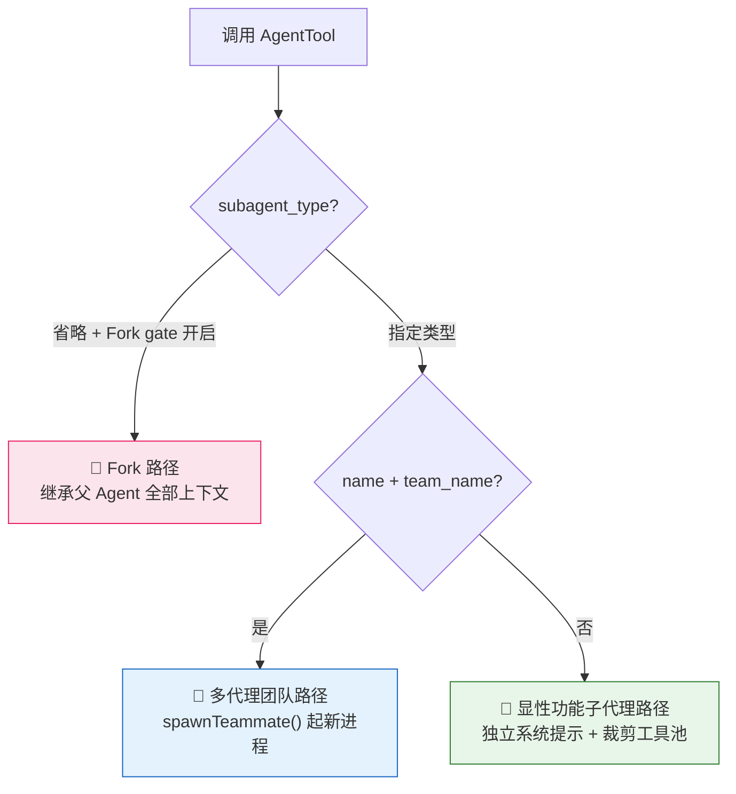
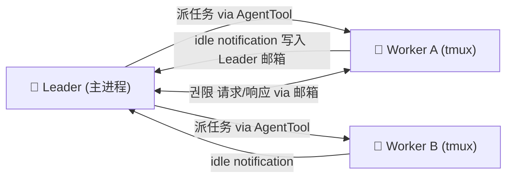
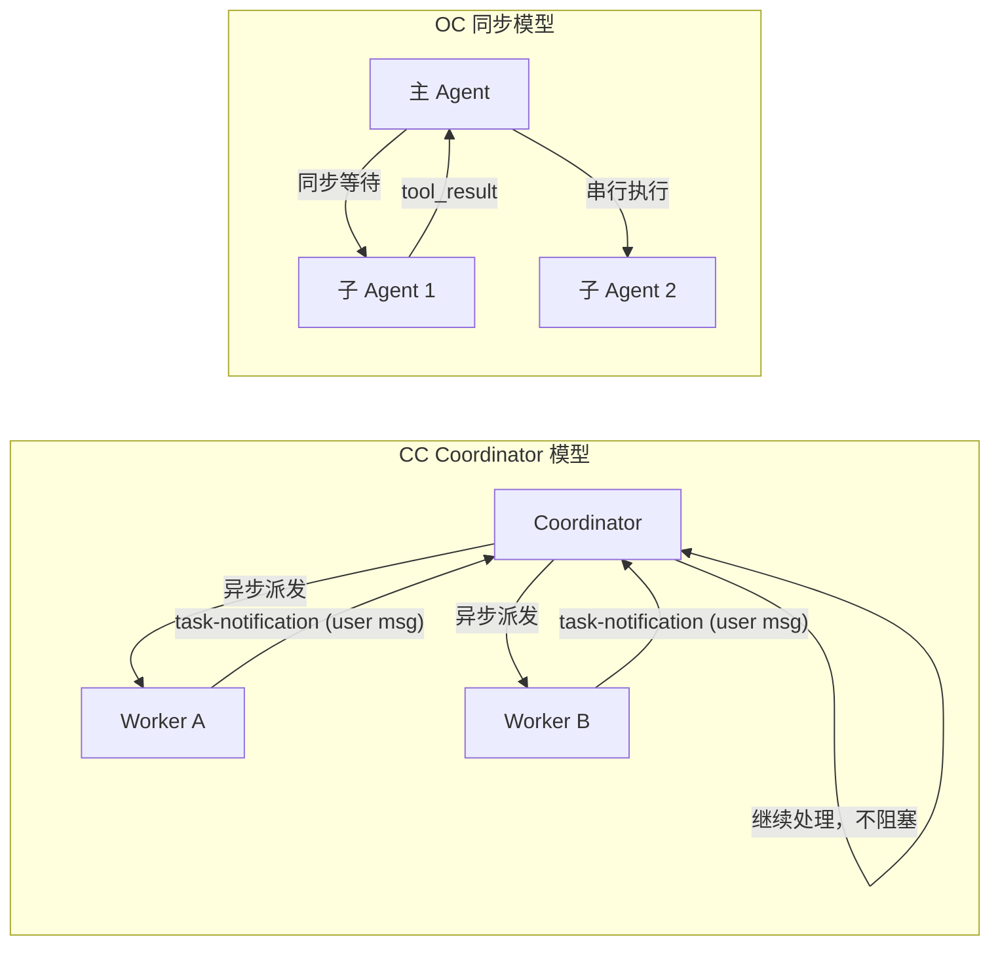

# 第4章：子代理与多 Agent——Claude Code 如何将自己"一分为多"

> **核心问题**：当一个任务需要并行推进、需要保护主上下文不被淹没、或者需要一个独立视角来验证自己的工作时，Agent 是如何从一个单一进程变成一套协作体系的？Claude Code 和 OpenClaw 在这里给出了截然不同的答案。

---

## 0. 起点：两套不同的哲学

在开始看代码之前，先把两个系统的核心理念说清楚：

**Claude Code：一切皆子代理（subagent-centric）**。CC 的多 Agent 策略建立在一个统一原语上：`AgentTool`（即 `Task` 工具）。无论是并行搜索、自动验证还是多工作流并行，都是这个 Tool 的不同路径。系统提示、工具池、权限模式——子代理启动时按需组装，互相隔离。

**OpenClaw：Coordinator-Worker 模型（coordinator-centric）**。OC 引入了一个明确的角色分工：有一个专门的 Coordinator 实例，负责任务拆解、派发指令、汇总结果；Worker 实例只负责执行具体工作。两者通过消息通道通信，Worker 完成后发来 `<task-notification>` XML，Coordinator 收到后决定下一步。

这两种哲学的分歧，体现在架构的每一个细节里。

---

## 1. CC 的三种 Agent 创建模式

在 CC 里，"派 Agent"这一个动作，对应三条完全不同的执行路径（`AgentTool.tsx#L318-L356`）：



| 模式 | 触发条件 | Context 来源 | AbortController |
|------|---------|-------------|----------------|
| Fork 子代理 | `subagent_type` 省略 + gate 开启 | 继承父代理完整对话 + 占位 tool_result | 独立（异步）|
| 功能子代理 | 指定 `subagent_type` | 独立系统提示 + 新的 user message | 继承（同步）或独立（异步）|
| 多代理团队 | `name` + `team_name` 都存在 | 新进程，完全独立 | 进程级隔离 |

---

## 2. Fork 子代理：Prompt Cache 共享的工程极致

Fork 是三条路径里工程最精妙的一条。

### 2.1 为什么要 Fork？

当主 Agent 在一轮里需要并行执行多个独立任务，最直观的做法是 spawn 多个功能子代理，每个拿一个全新的系统提示、从零开始对话。但这意味着每个子代理都会独占一个 Prompt Cache 槽位——60KB+ 的工具定义在每个子代理身上各缓存一份。

Fork 的设计目标正是为了消灭这种浪费：**让同时 fork 出的多个子代理，共享同一个 Prompt Cache 槽位。**

### 2.2 消息构造：占位符是整个设计的关键

`buildForkedMessages()` 函数（`forkSubagent.ts#L107`）构造的消息结构是：

```
[...父代理历史]
→ [父代理当前的 AssistantMessage（含所有 tool_use 块）]
→ [User message：占位 tool_result × N + 末尾的任务指令 text block]
```

**关键约束**：父代理在一轮里可能同时 fork 出 A、B、C 三个子代理，每个的任务指令不同。如果每个子代理产生的 API 请求有任何字节差异，它们就无法共享缓存。

解决方案：

```typescript
const FORK_PLACEHOLDER_RESULT = 'Fork started — processing in background'
```

所有 `tool_use` 块都用**完全相同**的占位文字作为 `tool_result`。所有子代理看到的 `toolResultBlocks` 都是字节相同的。**只有最末尾那个额外的 text block（即具体的任务指令）是不同的**。

结果：`[通用历史 + 相同 placeholder results]` 这部分所有 Fork 子代理全部命中缓存，只有 directive 那一块不缓存。

### 2.3 系统提示的字节级继承

Fork 子代理还有另一个反直觉的设计（`runAgent.ts#L508-L518`）：

```typescript
// Fork 路径：直接传递父代理已渲染的系统提示字节
const agentSystemPrompt = override?.systemPrompt
  ? override.systemPrompt  // ← Fork 路径走这里
  : asSystemPrompt(await getAgentSystemPrompt(...))  // ← 正常路径
```

Fork 子代理不重新调用 `getSystemPrompt()` 重建系统提示，而是直接传递父代理 `renderedSystemPrompt` 的字节副本。

原因：`getSystemPrompt()` 内部有 GrowthBook feature gate 的读取，它的"冷"和"暖"状态可能不同（Session 开始时读磁盘缓存，一段时间后从远程获取新值）。如果重新构建，子代理的系统提示字节可能与父代理的微小不同，导致 Prompt Cache miss。

### 2.4 防递归的两道防护

Fork 子代理保留了父代理的完整工具列表（包括 AgentTool 本身），以保证工具定义字节相同。但这带来了无限递归的风险。

CC 用两道防护阻止（`AgentTool.tsx#L326-L334`）：

1. **querySource 检查**（主要防护，AutoCompact 安全）：Fork 子代理的 `toolUseContext.options.querySource` 被设置为 `agent:builtin:fork`。这个值存在 context.options 里，即使 AutoCompact 把消息历史全部重写，这个标识也不会消失。

2. **消息扫描**（兜底防护）：扫描历史消息里是否包含 `<fork-boilerplate>` 标签。Fork 子代理任务开头会注入这段文字，因此可以通过历史消息检测。

这也是 `buildChildMessage()` 的开头为什么有那段"戏剧化"的告知：

```
STOP. READ THIS FIRST.
You are a forked worker process. You are NOT the main agent.
RULES (non-negotiable):
1. Your system prompt says "default to forking." IGNORE IT — that's for the parent.
   You ARE the fork. Do NOT spawn sub-agents; execute directly.
```

这不是在对模型说废话——这是**提示词层面的防护**，配合 querySource 和标签扫描，构成三层递归防卫。

---

## 3. 功能子代理：精心裁剪的独立世界

显性功能子代理拥有完全独立的上下文，从 CC 的内置 Agent 库里选取。

### 3.1 工具池的权限裁剪

每个内置 Agent 的工具权限在定义里写死，体现了"按最小特权原则"设计子 Agent：

| Agent | 禁用的工具 | 开放的工具 | 设计意图 |
|-------|-----------|-----------|---------|
| **Explore** | AgentTool, FileEdit, FileWrite, NotebookEdit | FileRead, Glob, Grep, Bash（只读） | 只搜索，禁修改 |
| **Verification** | AgentTool, FileEdit, FileWrite, NotebookEdit | Bash（可写 /tmp） | 只验证，禁改项目文件 |
| **Fork** | 无禁用 | `['*']`（继承全部） | 字节相同前缀 + cache 命中 |
| **Plan** | AgentTool, FileEdit, FileWrite | FileRead, Bash（只读） | 只制定计划 |

Verification Agent 允许写 `/tmp` 的权限是有意为之——验证者可能需要写测试脚本、编译临时文件，但绝不应该修改项目本身。

### 3.2 Context 精细裁剪

功能子代理的 Context 裁剪是 Token 成本的核心杠杆（`runAgent.ts#L385-L410`）：

**CLAUDE.md 剥离**（Explore 和 Plan Agent）：

```typescript
const shouldOmitClaudeMd =
  agentDefinition.omitClaudeMd &&
  !override?.userContext &&
  getFeatureValue_CACHED_MAY_BE_STALE('tengu_slim_subagent_claudemd', true)
```

注释里写得很直接：*"Dropping claudeMd here saves ~5-15 Gtok/week across 34M+ Explore spawns."*

CLAUDE.md 包含项目规约、提交规范、lint 规则——这些对只做搜索的 Explore Agent 毫无意义，但会消耗宝贵的 Token 预算。

**git status 剥离**（Explore 和 Plan Agent）：

```typescript
const resolvedSystemContext =
  agentDefinition.agentType === 'Explore' || agentDefinition.agentType === 'Plan'
    ? systemContextNoGit
    : baseSystemContext
```

Session 启动时采集的 git status 快照可达 40KB，且明确标注是 stale 的。搜索型 Agent 如果需要 git 信息，直接运行 `git status` 拿新鲜数据即可。

### 3.3 Verification Agent：对抗自身 LLM 倾向的系统设计

Verification Agent 的系统提示是整个 CC 代码库里最值得研读的文字之一，它直接命名了两个 LLM 在自我验证时的失败模式：

> **验证回避**：无论面对什么检查，都能找到不运行的理由——读代码、描述应该测试什么、写 "PASS"，然后继续。
>
> **被前 80% 诱惑**：看到精美的 UI 或通过的测试套件就觉得可以放行，没注意到有一半按钮什么也不做，刷新后状态消失，或者后端在边界输入时崩溃。

解决方案是**强制证据化输出格式**：

```
### Check: [验证点]
**Command run:** [实际执行的命令]
**Output observed:** [终端输出原文，不要解释]
**Result: PASS** (或 FAIL — 附 Expected vs Actual)
```

**没有 `Command run` 的 PASS 会被拒绝。**

```
// Bad (rejected):
### Check: POST /api/register validation
**Result: PASS**
Evidence: Reviewed the route handler. The logic correctly validates email format...
(没有命令输出，读代码不算验证)
```

主代理在收到报告后还会**抽查**：随机 re-run 报告里 2-3 条命令，检查输出是否匹配。这是更高层面的验证——验证"验证报告"本身是否诚实。

---

## 4. CC 多 Agent 体系：Coordinator 模式与 Agent 团队

### 4.1 Coordinator 模式

CC 提供了一个企业级的多 Agent 编排模式：通过环境变量 `CLAUDE_CODE_COORDINATOR_MODE=1` 激活。在这个模式下，主 Agent 的角色完全改变（`coordinatorMode.ts#L111`）：

Coordinator 的系统提示开头：
```
You are Claude Code, an AI assistant that orchestrates software engineering tasks 
across multiple workers.

## 1. Your Role
You are a coordinator. Your job is to:
- Help the user achieve their goal
- Direct workers to research, implement and verify code changes
- Synthesize results and communicate with the user
```

Coordinator 的工具集被专门定制：
- **AgentTool** — 派发新 Worker
- **SendMessageTool** — 继续既有的 Worker（发送后续指令）
- **TaskStopTool** — 中止运行中的 Worker
- 没有 FileEdit, FileWrite, Bash——Coordinator **不直接修改文件**

Worker 结果以 `<task-notification>` XML 的形式作为 user 消息到达 Coordinator：

```xml
<task-notification>
  <task-id>agent-a1b</task-id>
  <status>completed</status>
  <summary>Agent "Investigate auth bug" completed</summary>
  <result>Found null pointer in src/auth/validate.ts:42...</result>
  <usage>
    <total_tokens>4521</total_tokens>
    <tool_uses>8</tool_uses>
    <duration_ms>12480</duration_ms>
  </usage>
</task-notification>
```

### 4.2 Coordinator 内置的并发哲学

Coordinator 系统提示里有一段非常明确的并发指导原则：

> **Parallelism is your superpower. Workers are async. Launch independent workers concurrently whenever possible — don't serialize work that can run simultaneously and look for opportunities to fan out.**

并发管理规则：
- **只读任务**（研究）：自由并行
- **写入任务**（实现）：同一批文件一次只有一个 Worker
- **验证任务**：可与不同文件区域的实现并行

"Continue vs Spawn" 的决策框架也被明确写入 Coordinator 提示：

| 情况 | 策略 | 原因 |
|------|------|------|
| 研究覆盖了将要编辑的文件 | **Continue**（SendMessage） | Worker 已加载文件，现在给它明确计划 |
| 研究范围宽泛但实现很聚焦 | **Spawn fresh**（AgentTool） | 避免拖走探索阶段的噪音；聚焦的 Context 更干净 |
| 纠正失败或扩展最近的工作 | **Continue** | Worker 有错误 Context，知道刚才尝试了什么 |
| 验证另一个 Worker 刚写的代码 | **Spawn fresh** | 验证者应该以新鲜视角看代码，不带实现阶段的假设 |

### 4.3 Agent 团队（Swarms）：进程级并行

当 `name` 和 `team_name` 都存在时，CC 走的是进程级多 Agent 路径，通过 `spawnTeammate()` 在 tmux 新窗口起一个独立的 CC 进程。

团队中的 Agent 通过**文件系统邮箱（mailbox）系统**通信：

```
~/.claude/teams/<teamName>/mailboxes/<agentName>.json
```

每个 Agent 持续 poll 自己的邮箱（500ms 间隔）。权限确认请求通过邮箱发给 Leader，Leader 通过 UI 按钮回复 allow/reject。响应也写回邮箱，Worker 拿到响应后继续。



进程级隔离的关键特性：
- Worker 的 AbortController 独立于 Leader——Leader 按 ESC 不会杀 Worker
- Worker 有独立的缓冲区，AutoCompact 各自触发
- 但文件系统是共享的（默认情况下），写冲突风险真实存在

### 4.4 Worktree 隔离：文件系统级隔离

为了解决并行 Worker 的写冲突，CC 提供了 `isolation: 'worktree'` 参数：

```typescript
if (effectiveIsolation === 'worktree') {
  const slug = `agent-${earlyAgentId.slice(0, 8)}`
  worktreeInfo = await createAgentWorktree(slug)
}
```

每个 Worker 在独立的 git worktree 里操作，拥有相同代码库的不同工作副本。完成后，如果没有任何变更，worktree 自动删除；如果有变更，保留供用户合并。

Fork + Worktree 组合时，系统还会注入路径翻译提示：

```
You've inherited the conversation context above from a parent agent working in /Users/xxx/project.
You are operating in an isolated git worktree at /Users/xxx/project-agent-a1b3c5de — 
same repository, same relative file structure, separate working copy. 
Paths in the inherited context refer to the parent's working directory; 
translate them to your worktree root.
```

---

## 5. OC 对比：Interface Dispatch vs 内联管道

OpenClaw 在子代理这个维度上，最显著的工程差异体现在**上下文隔离的方式**和**Agent 定义的扩展方式**：

### 5.1 Agent 定义：YAML Frontmatter vs TypeScript 定义

**CC（TypeScript 定义，编译时固化）**：

```typescript
export const EXPLORE_AGENT: BuiltInAgentDefinition = {
  agentType: 'Explore',
  disallowedTools: [AGENT_TOOL_NAME, FILE_EDIT_TOOL_NAME, ...],
  model: process.env.USER_TYPE === 'ant' ? 'inherit' : 'haiku',
  omitClaudeMd: true,
  getSystemPrompt: () => getExploreSystemPrompt(),
}
```

内置 Agent 的能力边界在编译时就固化了，用户无法在运行时修改。

**OC（Markdown + YAML Frontmatter，运行时加载）**：

```yaml
---
agentType: my-reviewer
model: sonnet
tools: [Read, Grep, Glob]
permissionMode: readonly
disallowedTools: [Bash, FileWrite]
mcpServers:
  - github-mcp
hooks:
  SubagentStart: check-context.sh
---
You are a code reviewer specializing in security vulnerabilities...
```

OC 的 Agent 是文件，放在 `.agents/` 目录下，运行时扫描和加载。用户可以添加自己的 Agent、修改内置 Agent、通过 Plugin 分发 Agent。这是一个**开放的 Agent Registry**，CC 的相应机制是封闭的。

### 5.2 Coordinator vs 无中心化

CC 的 Coordinator 模式有一个明确的中心节点：一个专门的 Coordinator 实例，只负责编排，不干活。这种架构在大型任务上有明显优势——Coordinator 的上下文不会被实现细节污染，始终保持对全局状态的清晰把握。

OC 的多 Agent 场景更多是**去中心化的对等协作**：多个 Agent 可以通过 Task 系统相互派发任务，没有固定的"谁是 Boss"。这在灵活性上更强，但在任务依赖追踪和失败恢复上更复杂。

### 5.3 消息传递：task-notification vs 直接 tool_result

CC Coordinator 模式下，Worker 的结果通过 `<task-notification>` XML 以 **user 消息**的形式注入 Coordinator 的对话历史。这意味着：
- Coordinator 可以在多个 Worker 同时运行时，按完成顺序处理结果
- 等待中的结果不阻塞其他工作
- Coordinator 的对话历史里是"用户在告知我 Worker 完成了"，而不是"工具执行完返回了结果"

OC 更接近传统的同步 tool_result 模型：当 OC 调用子代理时，主循环等待子代理完成，结果作为 tool_result 返回。这在简单场景下更直观，但失去了 Coordinator 那种异步感知多个并行任务的能力。



---

## 6. 生命周期：同步 vs 异步

一个子代理究竟运行在父代理的时间线上，还是独立于父代理之外？这个问题决定了用户体验的根本差异。

**同步路径**（传统方式，`isAsync: false`）：
- 父代理的主循环进入阻塞等待
- 子代理完成后，结果作为 `tool_result` 返回
- 父代理继续下一轮推理
- 用户看到的是：一次工具调用，等待，返回结果

**异步路径**（现代方式，`isAsync: true`）：
```typescript
// 父代理不等待，立即返回
void runWithAgentContext(asyncAgentContext, () => runAsyncAgentLifecycle({...}))
return {
  status: 'async_launched',
  agentId: agentBackgroundTask.agentId,
  outputFile: getTaskOutputPath(...)
}
```
- 子代理独立开一个 `AbortController`，脱离父代理生命周期
- 用户按 ESC 取消主代理时，后台子代理不受影响
- 子代理的 transcript 写入 `outputFile`，有结果时再通知

关键阈值：`isForkSubagentEnabled()` 激活时，**所有** subagent 调用都被强制走异步路径（`forceAsync = true`）。还有 `getAutoBackgroundMs() = 120_000`：运行时间超过 2 分钟的子代理会被自动转入后台，即使原来是同步派发的。

---

## 核心洞察对比

| 设计维度 | Claude Code | OpenClaw |
|---------|------------|---------|
| **子代理定义方式** | TypeScript 硬编码，编译时固化 | YAML Frontmatter，运行时加载 |
| **Context 共享策略** | Fork 路径字节级继承 + Prompt Cache 共享 | 每次调用独立系统提示，重新构建 |
| **多 Agent 协作** | Coordinator 模式（中心化编排）+ Agent 团队（进程级） | 对等协作，Task 系统分发 |
| **结果传递** | 异步 `<task-notification>` user message 注入 | 同步 `tool_result` 返回 |
| **文件系统隔离** | Worktree 隔离（可选） | 无内置隔离（冲突需用户管理） |
| **Token 成本意识** | CLAUDE.md 剥离、git status 剥离、占位符缓存共享 | 各子 Agent 独立 Context，无专项优化 |
| **扩展性** | 封闭内置 Agent 库（Plugin 可扩展） | 开放 Agent Registry（.agents/ 目录） |

---

## 源码定位

| 功能 | 文件 | 关键行 |
|------|------|--------|
| Fork Agent 定义与递归防护 | `AgentTool/forkSubagent.ts` | L32, L78, L107, L171 |
| Fork vs 显性 subagent 路由分支 | `AgentTool/AgentTool.tsx` | L318-L356, L483-L541 |
| Coordinator 模式系统提示 | `coordinator/coordinatorMode.ts` | L111-L368 |
| CLAUDE.md / gitStatus 裁剪 | `AgentTool/runAgent.ts` | L385-L410 |
| 同步/异步生命周期分叉 | `AgentTool/AgentTool.tsx` | L686-L800 |
| Agent 团队邮箱通信 | `utils/swarm/inProcessRunner.ts` | L689-L800 |
| Explore Agent 定义 | `AgentTool/built-in/exploreAgent.ts` | 全文 |
| Verification Agent 系统提示 | `AgentTool/built-in/verificationAgent.ts` | L10-L129 |
| Worktree 隔离创建 | `AgentTool/AgentTool.tsx` | L590-L593 |
