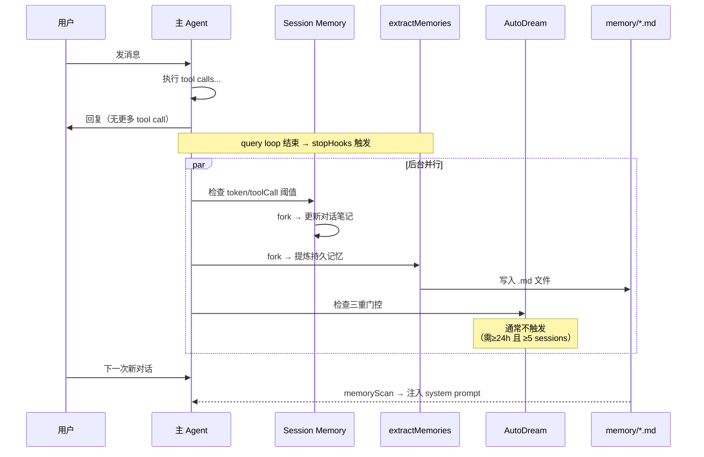

# Memory：Agent 的跨对话记忆

## 什么是 "Memory"？

在 Agent 的语境里，**Memory 指的是超出当前对话上下文窗口、能被 Agent 在未来的对话中重新获取的持久化知识**。

这跟日常说的"记忆"不太一样。一次对话过程中模型"看到"的所有消息——system prompt、用户消息、助手回复——这些**不是** Memory，这些是 **Context**（上下文）。Context 在对话结束后就消失了。

Memory 解决的核心问题是：

> **Agent 重启后、或者开始一次新对话时，怎么知道之前学过什么？**

比如：
- 用户上次告诉它"我喜欢简洁的代码风格"
- 它自己发现"这个仓库的入口文件是 `main.ts`"
- 过去五次对话都在做 API 重构，整体进度如何

这些知识如果不记录下来，每次对话都要重新发现。Memory 就是解决这个问题的机制。

---

## CC 和 OC 对 Memory 的两种回答

两个项目都实现了 Memory，但做了一个根本性的不同选择：**谁来决定记什么**。

- **CC 选择了"无意识记忆"**：系统在后台自动提炼，Agent 本身不知道自己在记忆。这像人类的程序性记忆——你不需要"决定"记住骑自行车，身体自己就记住了。
- **OC 选择了"有意识记忆"**：Agent 通过工具主动调用 `memory_search`/`memory_get`，它知道自己在查询记忆。这像人类的陈述性记忆——你主动回忆昨天吃了什么。

这个选择背后的原因不是谁设计得更好，而是**它们面对的 memory 体量完全不同**：

- CC 是单人开发者对单个项目。一个项目的 memory 通常是几十个 markdown 文件、几千行。这个体量可以**全量注入 system prompt**——启动时扫描 memory 目录，全部塞进去。所以不需要检索，Agent 直接在上下文里"看到"所有记忆。
- OC 是多 Agent 多通道。一个部署可能有几十个 Agent、数百个会话通道。memory 体量大得多，全量注入不现实。所以**必须有检索能力**——Agent 需要时主动搜索，而不是一股脑全塞进 prompt。

> **洞见**：CC 和 OC 的 memory 设计差异，根源不在架构哲学，而在于 **memory 体量假设**。当体量小到可以全量注入时，"无意识记忆"是更优解（零用户心智负担）。当体量大到必须检索时，"有意识记忆"成为必然。

**OC 的默认实现**：OC 默认捆绑了一个叫 `memory-core` 的内建插件（`slots.ts#L18`），开箱即用。架构上设计成可替换的 slot，但默认就有一个能工作的实现：

```typescript
// slots.ts#L17-20
const DEFAULT_SLOT_BY_KEY = {
  memory: "memory-core",      // 默认的 memory 插件
  contextEngine: "legacy",
}
```

---

## Claude Code 的三层 Memory

CC 的 Memory 设计有三个有明确分工的后台服务，按时间尺度从近到远排列：

### 第 1 层：Session Memory — 对 compaction 有损性的补偿

Session Memory 的存在本身就揭示了一个深层问题：**Compaction（对话压缩）是有损的，而且损失不可预测**。

如果 compaction 能完美保留所有重要信息，Session Memory 就没有存在的必要。但现实是，LLM 做摘要时不知道"用户后面还会不会用到这个细节"——它只能猜。Session Memory 的设计本质上是承认了这一点：与其指望 compaction 能猜对，不如**在压缩前就把可能重要的信息单独保存一份**，压缩后再注入回去。

这是一个典型的**预写日志（WAL）模式**——先写到安全的地方，再让危险操作（compaction）发生。

触发条件（`sessionMemory.ts#L134-181`）：token 增长超阈值 + tool call 次数超阈值，或 token 超阈值 + 本轮没 tool call（自然断点）。作用域仅限当前对话。

### 第 2 层：extractMemories — 写入优化的"L0 层"

每次 query loop 结束后（模型给出最终回复），系统用 forked agent 扫描本轮对话，提炼出项目知识，写入 `~/.claude/projects/<path>/memory/*.md`。下一次对话启动时全量注入 system prompt。

这里有一个容易忽略的设计选择：**extractMemories 每次都是独立写入，不去管之前已有的 memory 文件**。它只看"本轮对话有什么值得记住的"，然后追加。这意味着 memory 文件会随时间增长、出现重复甚至矛盾——这就是为什么需要第 3 层 AutoDream。

这个模式跟数据库的 **LSM-tree** 非常像：extractMemories 是 L0 层的快速写入（小文件、追加式、不去重），AutoDream 是 compaction（周期性合并、去重、重组织）。设计者有意选择了**写入优化而非读取优化**——因为 memory 的写入频率（每轮 query 一次）远高于读取频率（每次新对话一次），而且读取时是全量注入不需要随机访问。

### 第 3 层：AutoDream — 成本驱动的周期性整合

AutoDream 是 LSM-tree 类比中的 compaction 操作：周期性合并 extractMemories 写入的碎片文件。但它也是三层 memory 中最昂贵的——需要读取多个 session 的 transcript，用一次完整 LLM 调用整合。所有三层 memory 服务都依赖 forked agent，**每次运行都消耗真实的 API tokens**。

所以 AutoDream 的三重门控（`autoDream.ts#L5-8`）本质上是一个**成本控制机制**，按检查代价从低到高排序——如果最便宜的检查就能排除 99% 的情况，就不用执行后面更贵的检查：

| 门控 | 条件 | 代价 | 意义 |
|------|------|------|------|
| 时间 | ≥ 24h | 读一个时间戳（~0） | 即使一天开 50 个 session，也最多触发一次 |
| Session 数 | ≥ 5 个 | readdir（磁盘 I/O） | 过滤掉"时间到了但没什么新东西"的情况 |
| 并发锁 | 无其他进程 | 文件锁（一次 I/O） | 防止多个 CC 实例同时巩固 |

> **洞见**："把最便宜的过滤器放最前面"是一个值得学习的渐进式门控模式。它保证了在绝大多数 query loop 结束时，AutoDream 只做一次时间戳比较就退出了——一个几乎零成本的操作。

---

## 三层协作：一次完整的记忆流程



**时间尺度一览**：

| 层 | 时间尺度 | 触发频率 | 范围 |
|----|---------|---------|------|
| Session Memory | 分钟 | 每 N 个 tool call | 当前对话内部 |
| extractMemories | 回合 | 每次 query loop 结束 | 当前对话 → 持久化 |
| AutoDream | 天 | ≥24h 且 ≥5 sessions | 所有近期 session 整合 |

---

## OpenClaw 的 Memory：memory-core 内建插件

OC 的记忆不是三个固定的后台服务，而是通过**插件槽位（slot）**机制实现的。默认占据 memory slot 的插件叫 `memory-core`。

### 默认实现：memory-core

`memory-core` 是 OC 的**内建插件**，随 OC 一起打包分发。它提供：

- **`memory_search`**：向量检索——Agent 可以按语义搜索过去的记忆
- **`memory_get`**：精确获取——按 key 读取特定记忆条目
- **`memory_upsert`**：写入——Agent 主动保存新的记忆

底层存储后端默认为 `builtin`（源码 `memory-state.ts#L45-52`）：

```typescript
type MemoryRuntimeBackendConfig =
  | { backend: "builtin" }     // ← 默认：本地 embedding + 文件
  | { backend: "qmd"; ... }    // 可选：外部向量数据库
```

### memory-core 的 Memory Flush

OC 还有一个类似 CC extractMemories 的机制叫 **Memory Flush**：在 compaction 时把对话摘要写入 memory 文件。这不是 Agent 主动调用的，而是系统在 compaction hook 里自动触发的。（源码 `compaction-hooks.ts#L5-43`）

### 可替换性

因为 memory 是一个 slot，你可以换成其他插件：

```
// 配置示例：切换到另一个 memory 插件
plugins:
  slots:
    memory: "my-custom-memory-plugin"
```

切换时，OC 会自动禁用旧的 memory 插件（`applyExclusiveSlotSelection`），保证同一时刻只有一个 memory 插件激活。

---

## 总结：从 Memory 设计能学到什么

| 维度 | CC | OC | 为什么不同 |
|------|----|----|-----------|
| 记什么 | 系统自动判断 | Agent 主动决定 | 体量假设不同：小量可全注入，大量需检索 |
| 怎么存 | 纯 markdown 文件 | 向量 embedding + 文件 | 全量注入不需要索引，语义检索需要 |
| 怎么整合 | AutoDream 周期性巩固（LSM-compaction） | 无内建整合 | CC 的追加式写入会产生碎片 |
| 成本控制 | 三重门控 + forked agent 共享 cache | 工具调用按需触发 | forked agent 有真实 API 成本 |

**三个可迁移的设计模式**：

1. **WAL 模式对抗有损操作**：当系统中存在不可避免的信息损失点（如 compaction），在损失发生前用独立通道保存关键信息。Session Memory 就是 compaction 的 WAL。

2. **LSM-tree 式的写读分离**：如果写入频率远高于读取频率，且读取不需要随机访问，那么"先快速追加、后周期合并"比"每次写入都去重排"效率高得多。extractMemories + AutoDream 就是这个模式。

3. **渐进式门控控制成本**：当一个操作代价高昂时，用一系列从便宜到贵的前置检查来过滤。绝大多数情况在最便宜的检查中就被排除了。

---

## 源码定位

### Claude Code
| 文件 | 关键内容 |
|------|---------| 
| `extractMemories.ts#L1` | 每轮结束后提炼持久记忆的入口 |
| `sessionMemory.ts#L134` | `shouldExtractMemory()` — Session Memory 触发条件 |
| `autoDream.ts#L122` | `initAutoDream()` — 跨 session 巩固入口 |
| `autoDream.ts#L63` | `DEFAULTS` — 巩固触发阈值（24h / 5 sessions） |
| `paths.ts#L223` | `getAutoMemPath()` — Memory 文件存储路径解析 |
| `forkedAgent.ts` | `runForkedAgent()` — 所有记忆服务共用的 fork 基础设施 |

### OpenClaw
| 文件 | 关键内容 |
|------|---------|
| `slots.ts#L17` | 默认 memory slot → `memory-core` |
| `memory-state.ts#L45` | `MemoryRuntimeBackendConfig` — builtin / qmd 后端 |
| `plugin-skills.ts#L33` | `memorySlot` — memory 插件技能注入 |
| `compaction-hooks.ts#L5` | Memory Flush — compaction 时自动写入记忆 |
